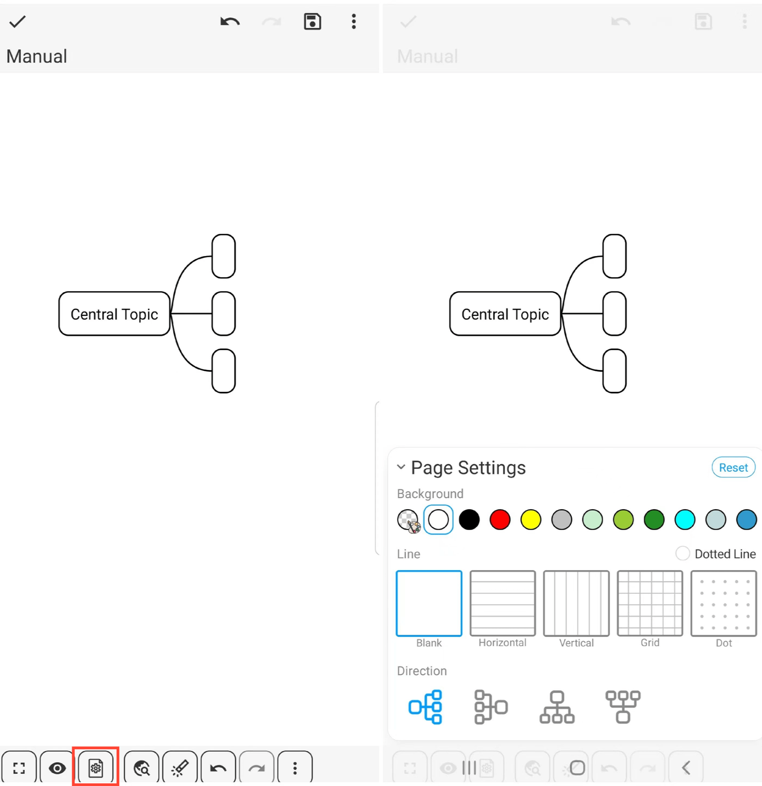

[User Manual](/dragonnest/drawnote/manual/it) > [Mind Mapping](/dragonnest/drawnote/manual/it/mind_mapping) >

Impostazioni Pagina
---
#### Passaggi

Fare clic sull'icona "Impostazioni Pagina" nella barra degli strumenti in basso per aprire il menu delle impostazioni pagina, dove è possibile personalizzare lo sfondo della pagina, lo stile della mappatura mentale e altro ancora.

