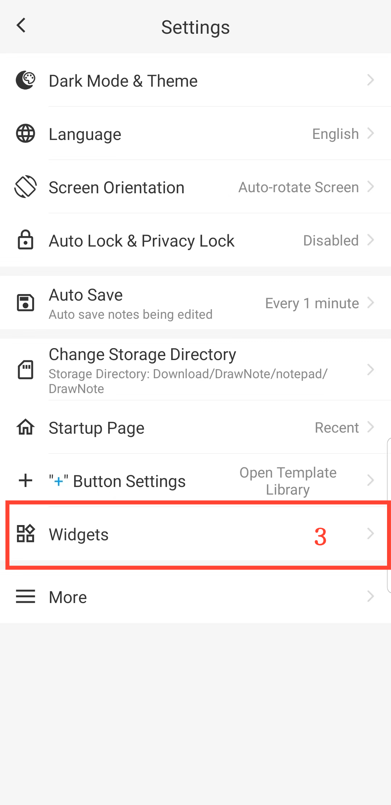

[Manuale Utente](/dragonnest/drawnote/manual/it) > [Altre Funzionalità](/dragonnest/drawnote/manual/it/more) >

Aggiungi Widget Desktop
---
Aggiungendo widget desktop alla schermata principale del dispositivo, è possibile accedere facilmente e rapidamente alle funzioni di modifica degli appunti senza aprire l'applicazione.
### Passaggi Operativi
1. Tocca "Io" sulla schermata principale.
2. Entra in "impostazioni".
3. Clicca su "Widget" e seleziona il tipo di widget che desideri aggiungere.

#### Suggerimenti
Puoi anche accedere direttamente alle impostazioni del widget sulla schermata principale del tuo dispositivo, trovare l'applicazione e quindi aggiungere il widget desktop.