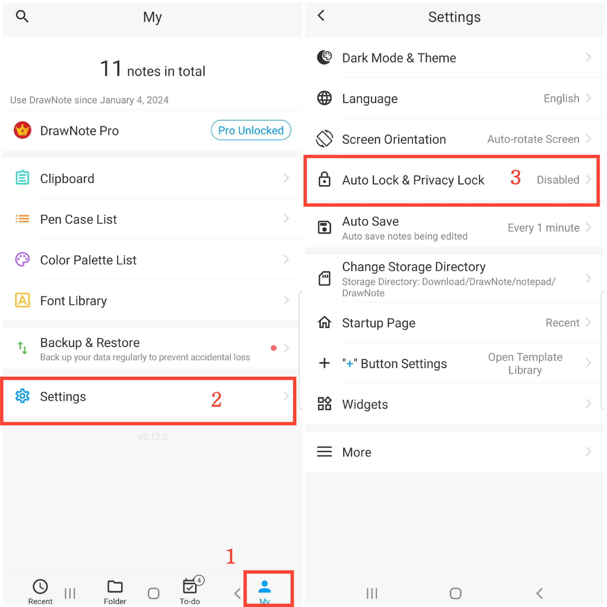
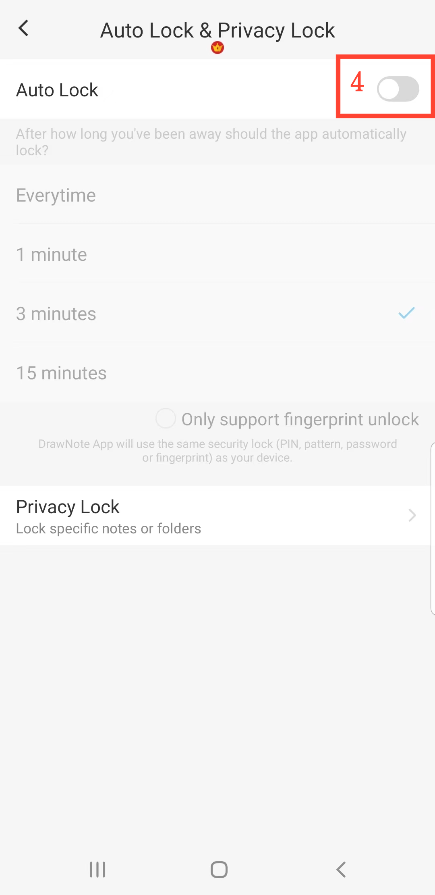

[User Manual](/dragonnest/drawnote/manual/it) > [More](/dragonnest/drawnote/manual/it/more) >

Blocco Automatico
---
Il blocco automatico si riferisce all'applicazione che si blocca automaticamente dopo un periodo di inattività. Per migliorare la privacy e la sicurezza dei dati, impedendo l'accesso non autorizzato.

#### Passaggi

1. Tocca "Io" nella pagina principale.

2. Accedi alle impostazioni.

3. Clicca su "Blocco automatico & Blocco  Privacy".

4. Attiva il pulsante "Blocco automatico" e seleziona il tempo di blocco automatico.

