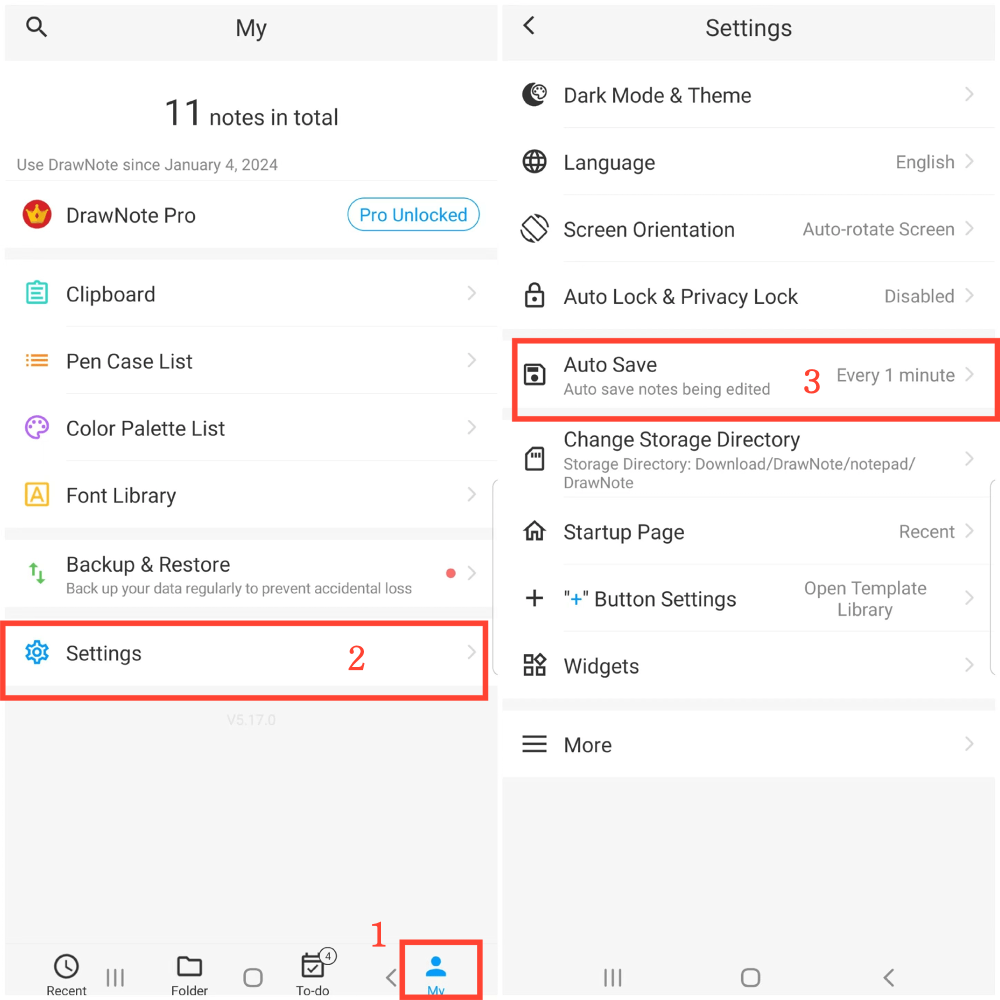
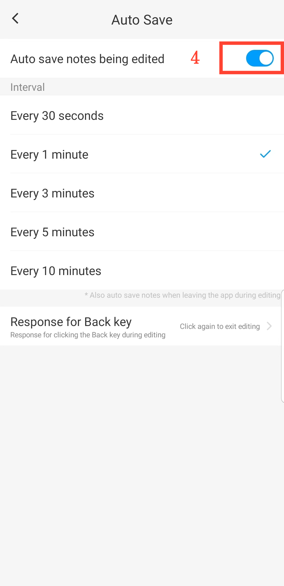

[User Manual](/dragonnest/drawnote/manual/en) > [More](/dragonnest/drawnote/manual/en/more) >

Salvataggio Automatico
---
Il salvataggio automatico previene la perdita accidentale di dati.

#### Passaggi

1. Tocca "Io" nella pagina principale.

2. Accedi alle impostazioni.

3. Clicca sul pulsante "Salvataggio automatico".

4. Abilita il pulsante e seleziona il tempo di salvataggio automatico.

#### Suggerimenti
- Risposta personalizzabile per il clic del tasto Indietro durante la modifica. I metodi di risposta includono: fare clic di nuovo per uscire dalla modifica, chiedere conferma, uscire e salvare.

  