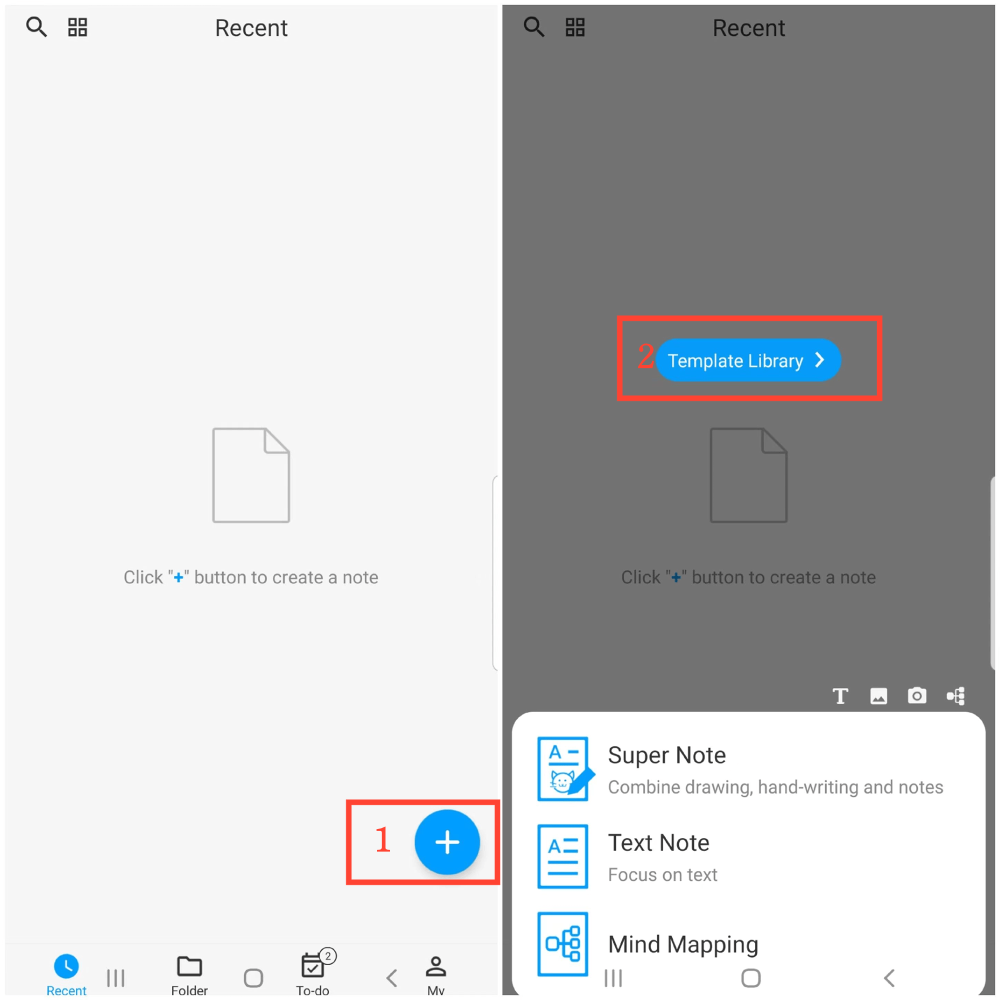
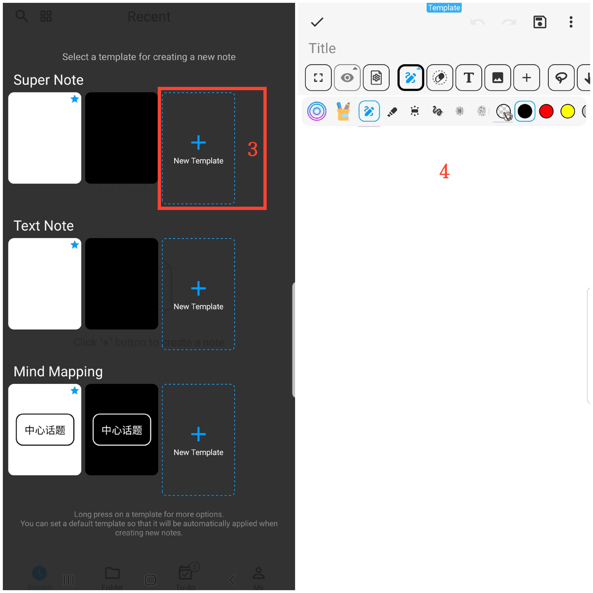

[Manuale Utente](/dragonnest/drawnote/manual/it) > [Altre Funzionalità](/dragonnest/drawnote/manual/it/more) >

Creazione di Modelli
---
Creando modelli, è possibile applicare automaticamente la configurazione del modello durante la creazione di una nuova nota, come il colore dello sfondo, la dimensione del carattere, il colore del carattere e altre impostazioni comuni.

### Passaggi
1. Sulla homepage dell'app, tocca l'icona "+" nell'angolo in basso a destra.
2. Tocca "Libreria Modelli".
3. Seleziona "Nuovo Modello" dopo il tipo di nota desiderato.
4. Entra nella pagina di modifica del modello per impostare le configurazioni, incluse il colore dello sfondo, la dimensione del carattere, il colore del carattere, ecc., e salva quando hai finito.

#### Suggerimenti
Tieni premuto sulla libreria dei modelli per accedere a più opzioni, come visualizzare e Modifica Modello, Imposta come Modello Predefinito, ecc.
