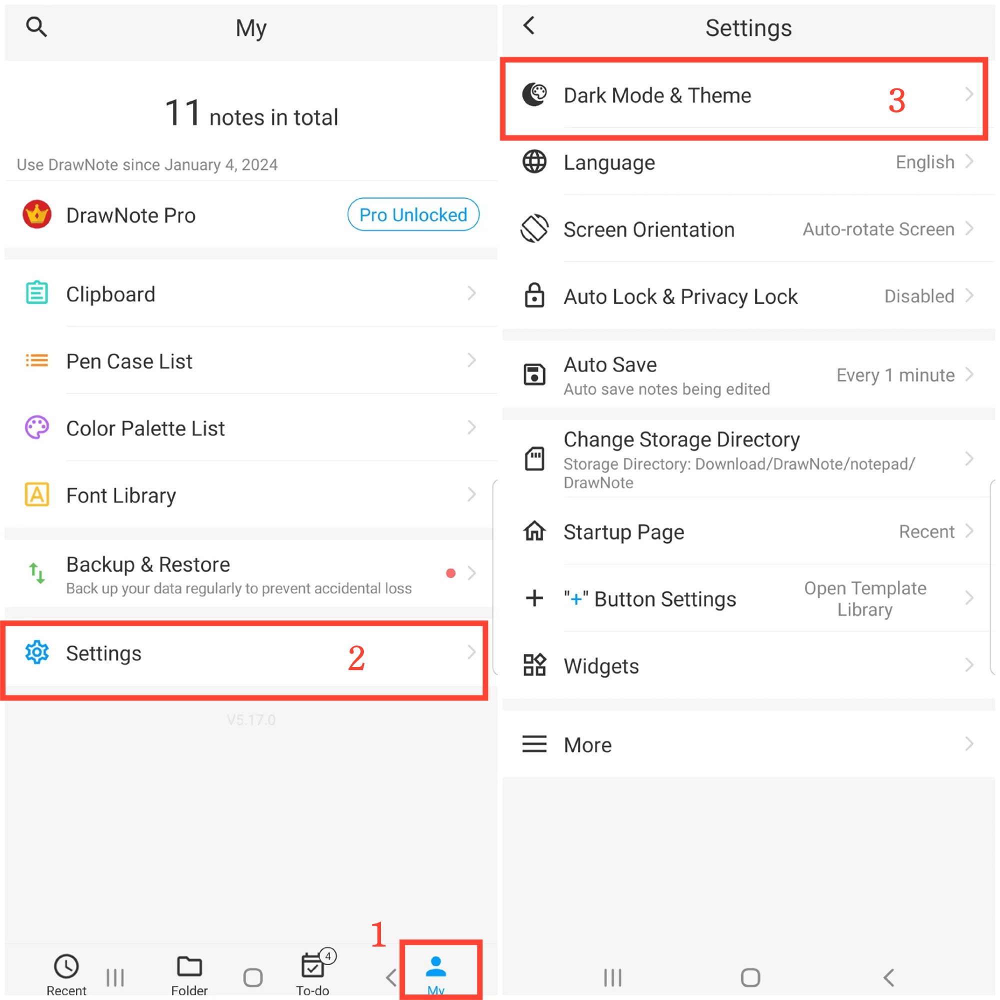

[Manuale Utente](/dragonnest/drawnote/manual/it) > [Altre Funzionalità](/dragonnest/drawnote/manual/it/more) >

Modalità Oscura e Cambio di Tema
---
La modalità oscura offre un'esperienza di lettura più confortevole, contribuendo a ridurre l'affaticamento degli occhi e a proteggere la salute visiva. Questa funzionalità consente di passare facilmente a una modalità scura più confortevole e di scegliere i colori del tema in base alle preferenze personali.

### Passaggi Operativi
1. Tocca "Io" sulla schermata principale.
2. Vai alle Impostazioni.
3. Clicca su "Modalità Oscura & Tema".
4. Qui puoi passare alla modalità scura e scegliere diversi colori del tema per personalizzare l'interfaccia a tuo piacimento.

