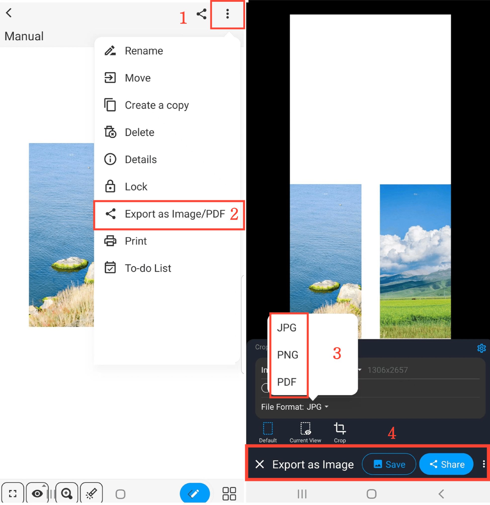

[User Manual](/dragonnest/drawnote/manual/it) > [More](/dragonnest/drawnote/manual/it/more) >

Esporta/Condividi Appunti
---
Ci sono due metodi per esportare/condividere gli appunti.

#### Metodo 1
1. In modalità lettura, fare clic sull'icona "Condividi" nell'angolo in alto a destra della lavagna.

2. Scegli il formato del file in cui desideri esportare il tuo appunto.

3. Seleziona "Salva" o "Condividi" e scegli il metodo di condivisione per completare l'azione.

#### Metodo 2
1. In modalità lettura, fare clic sull'icona "⋮" more nell'angolo in alto a destra.

2. Seleziona "Esporta come Immagine/PDF".

3. Scegli il formato del file in cui desideri esportare il tuo appunto.

4. Clicca su "Salva" o "Condividi" e scegli il metodo di condivisione per completare l'azione.

