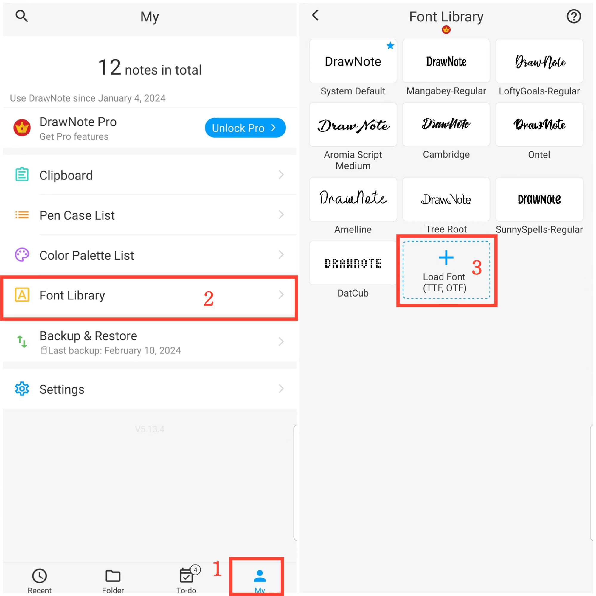

[User Manual](/dragonnest/drawnote/manual/en) > [More](/dragonnest/drawnote/manual/en/more) >

Libreria Caratteri
---
La libreria di caratteri può salvare i tuoi caratteri comunemente usati. Ti consente di scegliere liberamente lo stile del carattere appropriato nelle note di testo o nelle caselle di testo.
#### Passaggi
1. Tocca "Io" sulla schermata principale.

2. Accedi alla libreria  caratteri.

3. Clicca su "Carica carattere" e seleziona un file di carattere da importare.

#### Suggerimenti
Puoi scaricare i caratteri desiderati da questo sito web: https://www.fontspace.com/commercial-fonts