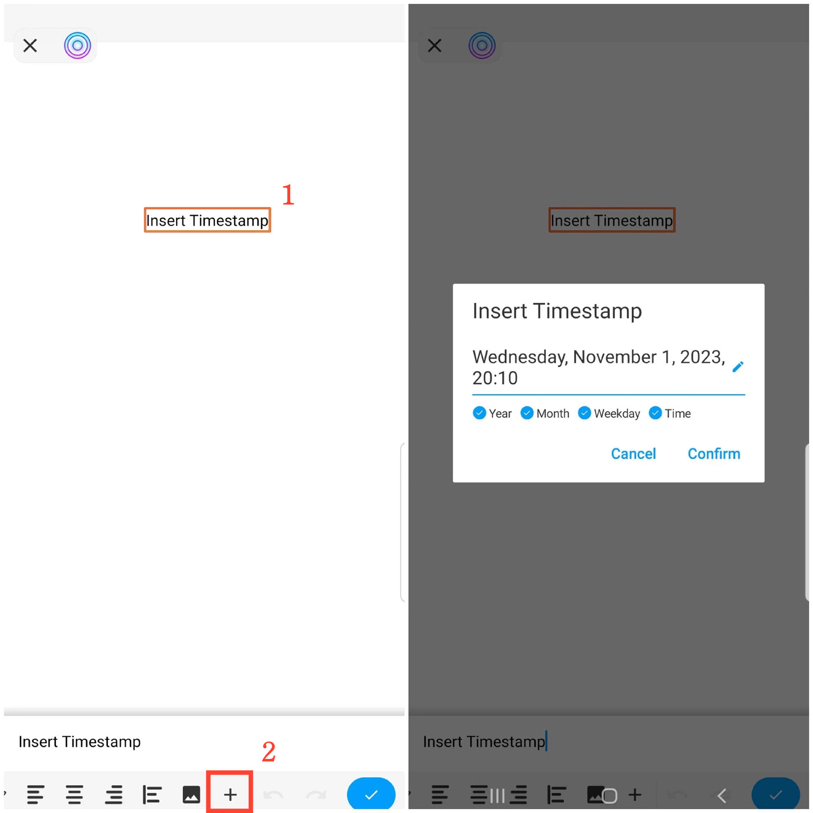

[Manuale Utente](/dragonnest/drawnote/manual/it) > Altre Funzionalità(/dragonnest/drawnote/manual/it/more) >

Inserimento Timestamp
---
Inserire un timestamp rende facile registrare l'ora delle tue note.

#### Passaggi
Nelle note di testo, scorri verso sinistra e tocca l'icona "+", quindi seleziona "Inserisci Timestamp" e conferma.

In Super Nota e Mappatura Mentale, seleziona una casella di testo, apri il menu di testo, scorri verso sinistra e tocca l'icona "+", quindi scegli "Inserisci Timestamp" e conferma.

