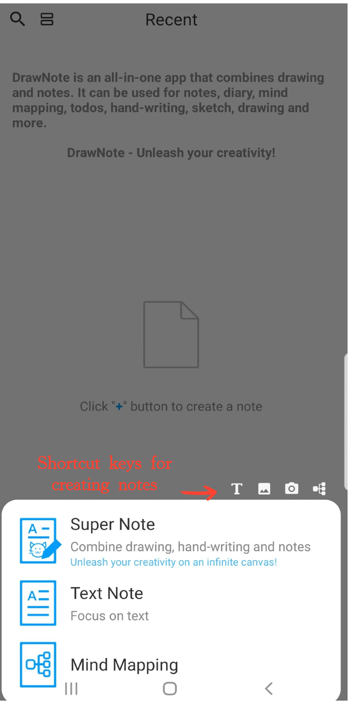

[Manuale Utente](/dragonnest/drawnote/manual/it) >

Creare un Nuovo Appunto
---
DrawNote offre una varietà di tipi di appunti flessibili per soddisfare diverse situazioni degli utenti, tra cui Super Nota, Nota di Testo e Mappa Mentale.

- Super Nota - Un appunto completo che combina scrittura a mano, disegno, testo, immagini, registrazioni audio, tabelle e mappe mentali. Ti consente di esprimere pienamente la tua creatività e il tuo talento artistico su una tela flessibile.

- Nota di Testo - Concentrato sulla registrazione di testo e supporta impostazioni di testo ricco così come inserimenti di immagini, rendendo i tuoi appunti più diversificati e visivi.

- Mappa Mentale - Ti aiuta a catturare rapidamente idee e organizzare conoscenze, presentando concetti complessi in una struttura grafica chiara.

#### Passaggi

Sulla homepage dell'app, tocca l'icona "+" nell'angolo in basso a destra. Quindi, seleziona il tipo di appunto che desideri creare per iniziare il tuo appunto.

#### Suggerimenti

- Quando tocchi il pulsante "+" nella sezione 'Cartelle' per creare un nuovo appunto, l'appunto verrà automaticamente categorizzato nella cartella corrente.

- Puoi anche utilizzare le scorciatoie nella parte superiore del menu per accedere rapidamente a varie interfacce di creazione all'interno di Super Appunto.

