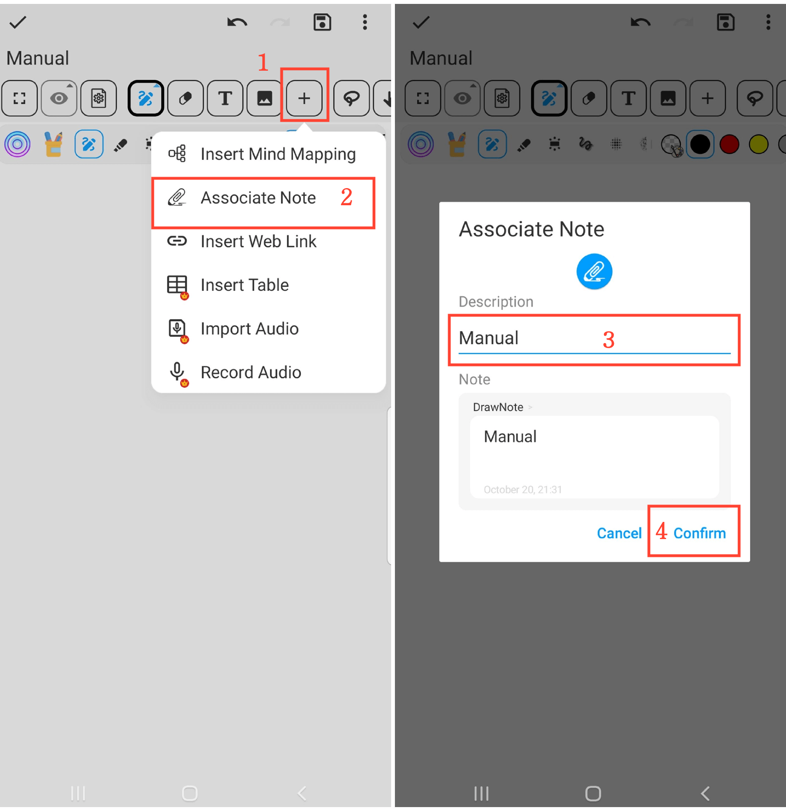

[Manuale Utente](/dragonnest/drawnote/manual/it) > [Super Appunto](/dragonnest/drawnote/manual/it/super_note) >

Associate Nota
---

La funzione delle note associate consente di collegare facilmente note correlate, migliorando l'organizzazione e l'efficienza della ricerca delle tue note.

#### Passaggi

1. Fare clic sul pulsante "+" nella barra degli strumenti.

2. Fare clic su "Associate Nota" e selezionare la nota che si desidera collegare.

3. Dare un nome alla nota associata (opzionale).

4. Fare clic su "Conferma" per aggiungere la nota collegata alla nota corrente.

#### Suggerimenti

- Dare un nome alle note associate aiuta a una ricerca e gestione più veloci.

- Utilizzare il filtro "Ordine Cronologico" o "Cartella" può aiutare nella selezione più rapida delle note.