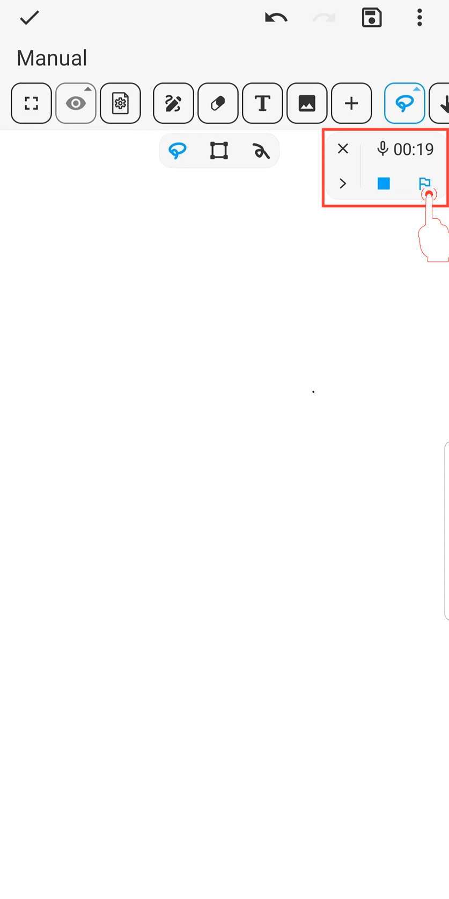
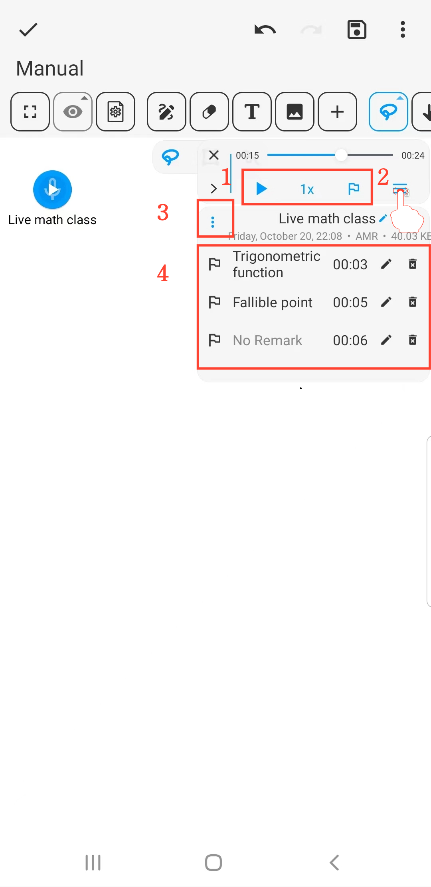

[Manuale Utente](/dragonnest/drawnote/manual/it) > [Super Nota](/dragonnest/drawnote/manual/it/super_note) >

Marcatore Audio
---
Il marcatore audio è simile a un segnalibro, che ti aiuta a individuare rapidamente e riprodurre le sezioni chiave durante la registrazione o la riproduzione audio.

#### Passaggi

Durante la registrazione o la riproduzione, fare clic sul pulsante "Marcatore" per inserire un marcatore al tempo corrente.

#### Suggerimenti

1. **Regola la velocità audio e aggiungi marcatori** - Facilmente fatto nella barra degli strumenti.

2. **Modifica registrazione e nomi dei marcatori** - Fare clic sul pulsante "≡" a destra, quindi fare clic sul pulsante "Penna".

3. **Scarica l'audio** - Fare clic sul pulsante "⋮" a sinistra per scaricare.

4. **Visualizza la cronologia dei marcatori audio** - Visualizza i marcatori nel menu espanso; fare clic su un marcatore per passare rapidamente e riprodurre l'audio.

