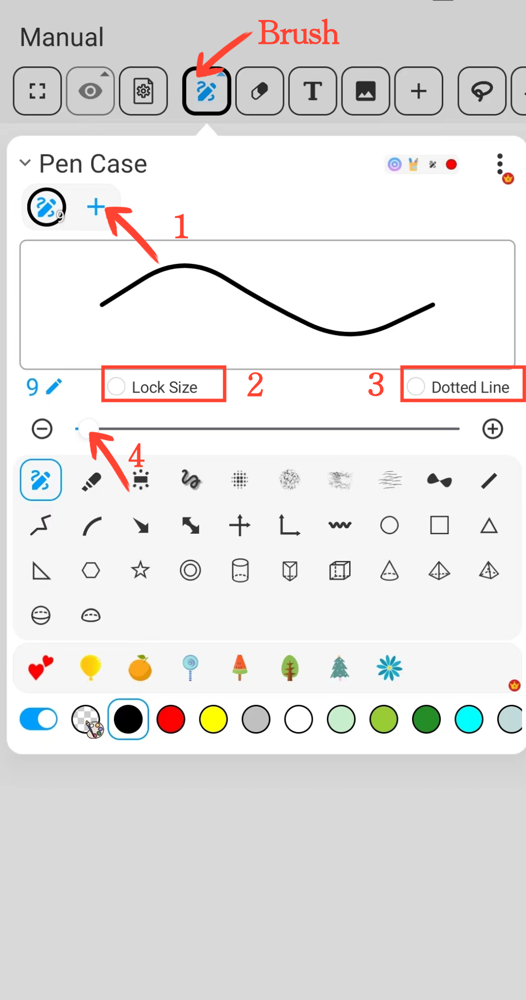
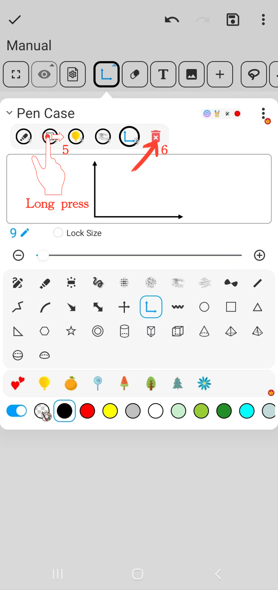

[Manuale Utente](/dragonnest/drawnote/manual/it) > [Super Nota](/dragonnest/drawnote/manual/it/super_note) >

Funzione Custodia per Penne
---

#### Passaggi

Fare clic sul pulsante "Custodia per Penne" nella barra degli strumenti per eseguire le seguenti azioni.

#### 1. Raccogliere Pennelli

Fare clic sul pulsante "+" nella barra di raccolta dei pennelli per aggiungere diversi tipi di pennelli.

#### 2. Bloccare la Dimensione del Custodia per Penne

Selezionare il pulsante "Blocca Dimensione" per fissare la dimensione del Custodia per Penne. Anche se si ingrandisce o ridimensiona la tela o la pagina, la dimensione del Custodia per Penne rimarrà invariata.

#### 3. Effetto Linea Tratteggiata

Selezionare il pulsante "Linea Tratteggiata" per applicare l'effetto Custodia per Penne a linea tratteggiata.

#### 4. Regolare la Dimensione del Custodia per Penne

Utilizzare il cursore centrale o i pulsanti "+" e "-" ai lati per regolare la dimensione della pennellata.

#### 5. Regolare la Posizione del Custodia per Penne

Nella barra dei pennelli, tenere premuto il Custodia per Penne che si desidera regolare, quindi trascinarlo a sinistra o a destra nella posizione desiderata e rilasciarlo.

#### 6. Eliminare Pennelli Raccolti

Nella barra dei pennelli, tenere premuto il Custodia per Penne che si desidera eliminare, quindi trascinarlo sull'icona del "Cestino" e rilasciarlo per rimuovere quel Custodia per Penne.

#### Salvare la Cassa Pennelli Comune
Sulla pagina del Custodia per Penne, fare clic sul pulsante "⋮" nell'angolo in alto a destra e scegliere "Salva nella Lista Pennelli". Quindi, dare un nome al proprio set di pennelli e confermare per salvare il set di pennelli comunemente utilizzati.

#### Scegliere la Cassa Pennelli Comune
Sulla pagina del Custodia per Penne, fare clic sul pulsante "⋮" nell'angolo in alto a destra, quindi selezionare il set di pennelli di cui si ha bisogno dalla lista dei pennelli.

