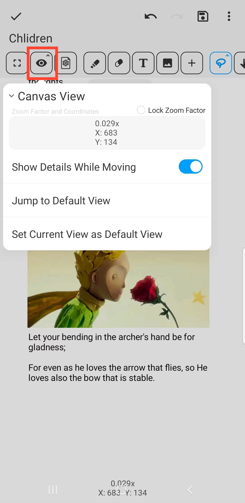

[User Manual](/dragonnest/drawnote/manual/en) > [Super Note](/dragonnest/drawnote/manual/en/super_note) >

Canvas View
---
The canvas view is the interface for viewing and editing notes, containing coordinate and zoom information.

- To facilitate browsing large or content-rich pages, you can set a default view.

- Click the "Jump to Default View" button to quickly return to your set default view position.

#### Lock Zoom Ratio
After checking "Lock Zoom Ratio", the canvas will maintain its current zoom level, preventing gesture-based zooming.