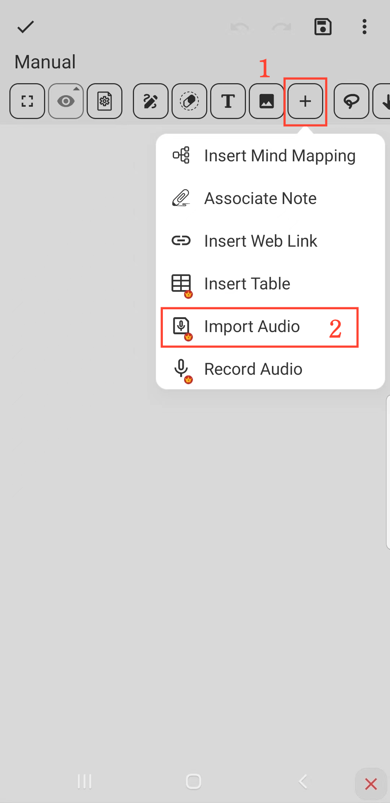

[Manuale Utente](/dragonnest/drawnote/manual/it) > [Super Nota](/dragonnest/drawnote/manual/it/super_note) >

Importa Audio
---
#### Passaggi

1. Fare clic sul pulsante "+" nella barra degli strumenti.

2. Scegliere l'opzione "Importa Audio". Selezionare il file audio che si desidera importare e il gioco è fatto.

