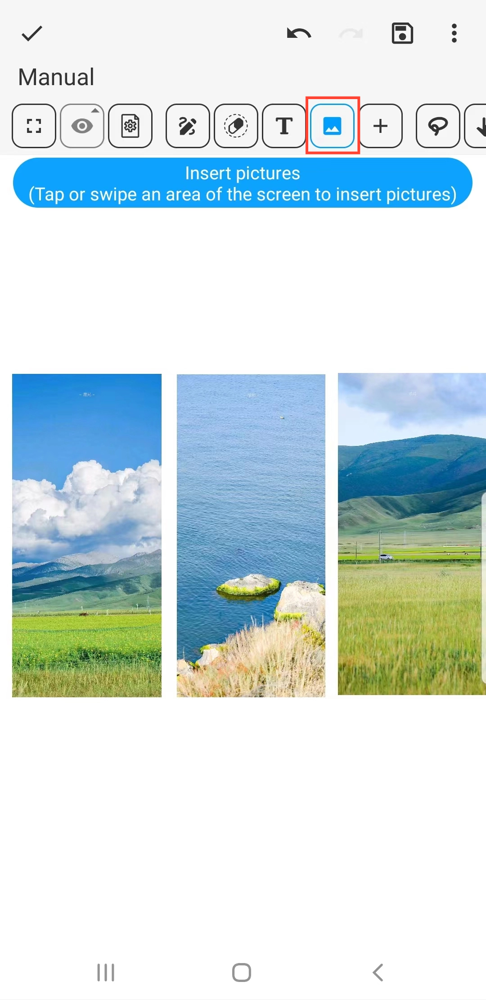

[Manuale Utente](/dragonnest/drawnote/manual/it) > [Super Nota](/dragonnest/drawnote/manual/it/super_note) >

Inserisci Immagini
---
#### Passaggi

1. Fare clic sul pulsante "Immagine" nella barra degli strumenti.

2. Toccare o sfiorare un'area dello schermo per inserire immagini.

#### Suggerimenti
- Dopo aver selezionato un'immagine, la barra degli strumenti inferiore fornisce opzioni di modifica, come Rotazione, Forma e Trasparenza.

- È possibile combinare la funzione di testo per annotare i contenuti dell'immagine per un'espressione più dettagliata e accurata.

- Fare clic sull'immagine per ridimensionarla.

