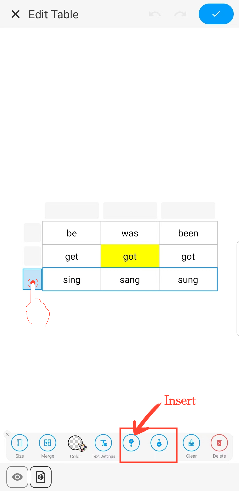
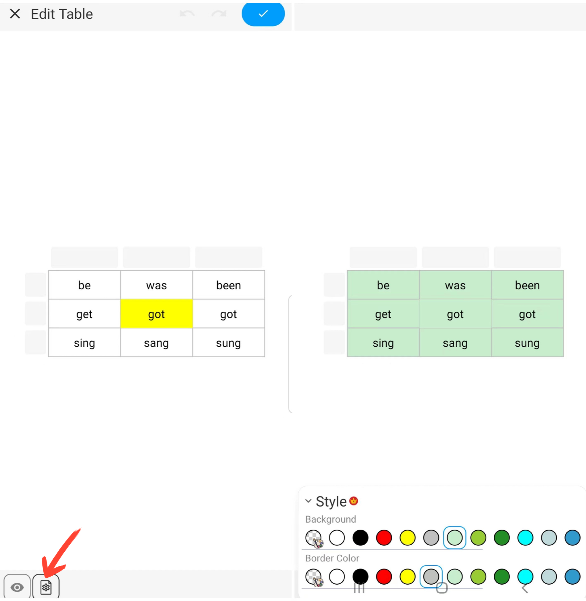

[Manuale Utente](/dragonnest/drawnote/manual/it) > [Super Nota](/dragonnest/drawnote/manual/it/super_note) >

Inserisci Tabella
---
#### Passaggi

1. Fare clic sul pulsante "+" nella barra degli strumenti.

2. Scegliere "Inserisci Tabella" per aggiungere una tabella alle proprie note.

#### Suggerimenti
- Impostare il numero di celle - Scorrere o inserire numeri per scegliere il numero di celle richiesto.

- Regolare larghezza e altezza della tabella - Scorrere il cursore delle dimensioni o inserire numeri per impostare le dimensioni predefinite delle celle.

- Modificare il formato delle celle - Una volta selezionata una cella, è possibile impostarne la dimensione, il colore e cancellare il suo contenuto.

- Modificare il formato del testo nelle celle - Una volta selezionata una cella, è possibile modificare il contenuto e il formato del testo, inclusi colore, dimensione del font, grassetto, sottolineatura e allineamento.

- Impostare il formato per un'intera riga o colonna - Una volta selezionata una riga o colonna, è possibile unire celle, impostare il colore di sfondo, cancellare il contenuto e altro ancora.

- Inserire un'intera riga o colonna - Una volta selezionata una riga o colonna, fare clic sul pulsante "Inserisci" per aggiungere una nuova riga o colonna.

- Impostare l'aspetto della tabella - Fare clic sul pulsante "Impostazioni" in basso a sinistra della tela e, nel menu, impostare il colore di sfondo e del bordo della tabella.

