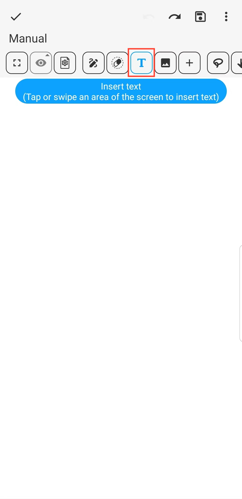

[Manuale Utente](/dragonnest/drawnote/manual/it) > [Super Nota](/dragonnest/drawnote/manual/it/super_note) >

Inserisci Testo
---
#### Passaggi

1. Fare clic sul pulsante "T" nella barra degli strumenti.

2. Toccare o sfiorare un'area dello schermo per inserire il testo.

#### Suggerimenti
- Una volta selezionata la casella di testo, è possibile Ruotare, Allineare, Modificare e altro ancora. Cliccando su "Altro", è anche possibile creare una copia, tagliare negli appunti e bloccare e altro ancora.

  

- Nella casella di modifica del testo, una volta selezionato il testo, è possibile impostarne il formato, incluso colore, dimensione, grassetto, sottolineatura e altro ancora.

