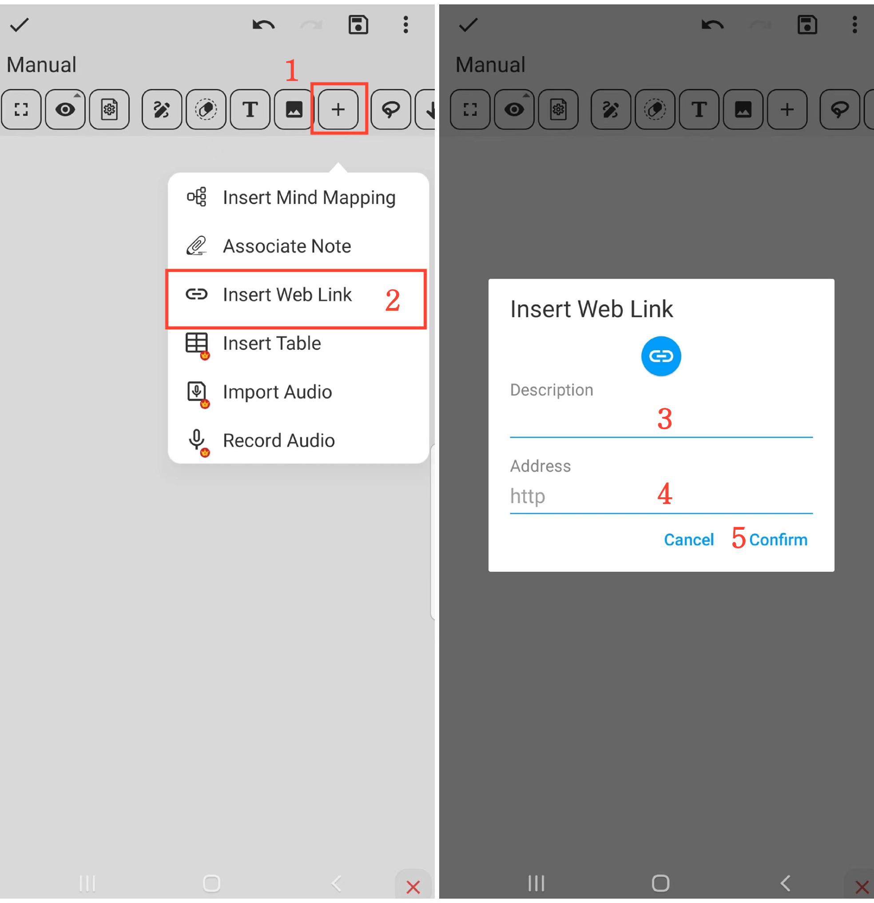

[Manuale utente](/dragonnest/drawnote/manual/en) > [Super Nota](/dragonnest/drawnote/manual/en/super_note) >

Inserire Collegamento Web
---
#### Passaggi

1. Fare clic sul pulsante "+" nella barra degli strumenti.

2. Scegliere l'opzione "Inserisci Collegamento Web".

3. Inserire il nome del collegamento (opzionale).

4. Digitare o incollare il collegamento web.

5. Confermare l'operazione per inserire il collegamento.

#### Suggerimenti
- Dare al collegamento un nome descrittivo per facilitarne la ricerca e la localizzazione in seguito.

- In modalità lettura, fare clic sull'icona del collegamento per accedere direttamente alla pagina web.