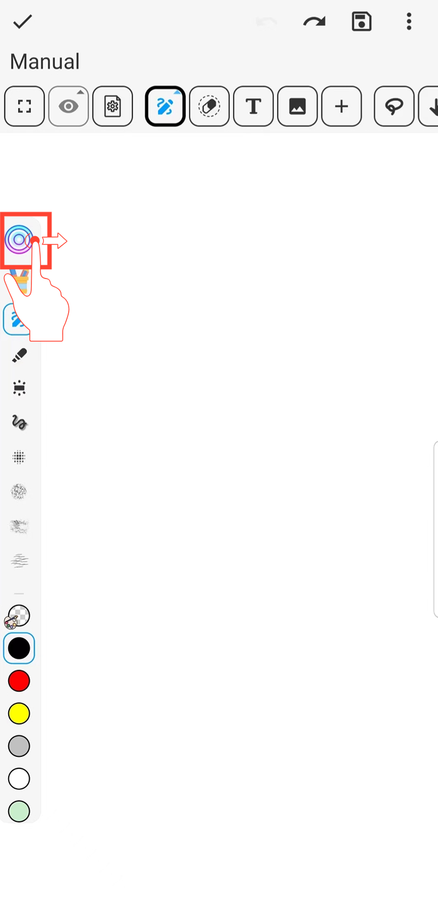

[Manuale Utente](/dragonnest/drawnote/manual/it) > [Super Nota](/dragonnest/drawnote/manual/it/super_note) >

Sposta la Barra degli Strumenti della Matita
---

Puoi regolare la posizione orizzontale o verticale della barra degli strumenti della matita sulla tela, consentendo un facile movimento su e giù o da sinistra a destra.

#### Passaggi

1. Nella Custodia della Penna, seleziona "Stile Barra degli Strumenti".

2. Scegli l'allineamento orizzontale o verticale.

3. Verifica per confermare.

#### Suggerimenti
- Tieni premuto il pulsante circolare sulla barra degli strumenti della matita per trascinarlo e regolarne la posizione.

