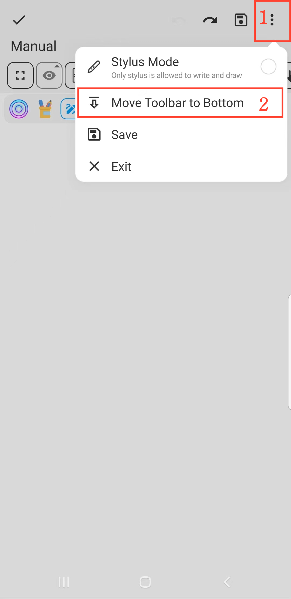

[User Manual](/dragonnest/drawnote/manual/en) > [Super Note](/dragonnest/drawnote/manual/en/super_note) >

Move Toolbar
---
#### Steps

1. Click the "⋮" button in the top right corner of the canvas.

2. Choose the toolbar position: "Move Toolbar to the Bottom" or "Move Toolbar to the Top".

