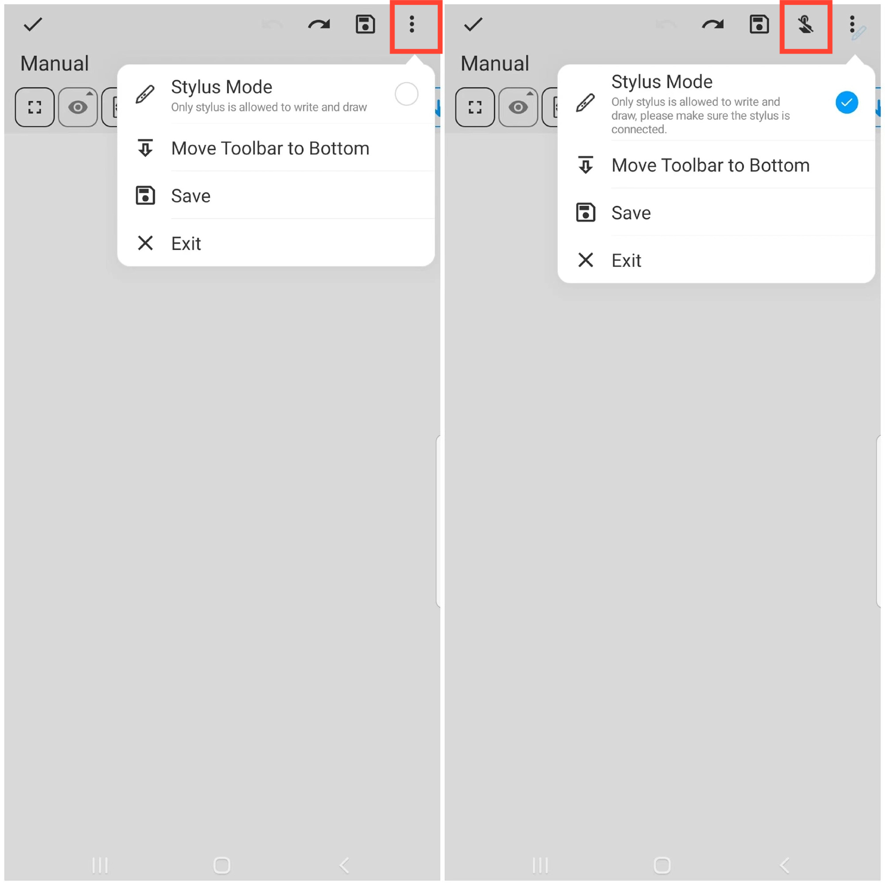

[User Manual](/dragonnest/drawnote/manual/it) > [Super Nota](/dragonnest/drawnote/manual/it/super_note) >

Modalità Penna Stilo
---

#### Passaggi

1. All'interno della pagina Super Nota, toccare il pulsante "⋮" più situato in alto a destra dello schermo.
2. Selezionare l'opzione Modalità Penna Stilo per attivarla.
   

#### Suggerimento
- Prima di entrare nella Modalità Penna Stilo, assicurarsi che la penna stilo sia collegata con successo.
- Dopo aver attivato la Modalità Penna Stilo, verrà visualizzata un'icona che indica "Nessun tocco del dito" nella parte superiore della pagina. È possibile toccare questa icona per evitare tocchi non intenzionali con le dita.