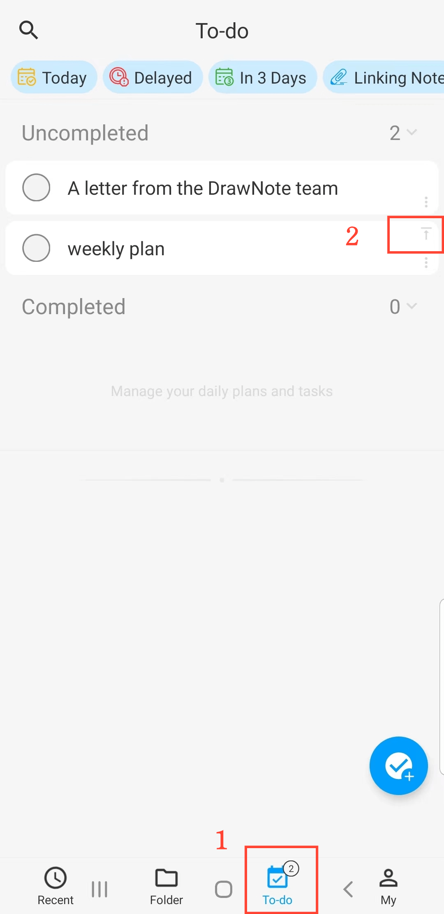

[Manuale Utente](/dragonnest/drawnote/manual/it) > [Lista delle Attività](/dragonnest/drawnote/manual/it/to_do) >

Crea un nuovo elemento da fare
---
#### Passaggi

1. Navigare alla pagina 'da fare'.

2. Fare clic sul pulsante "+".

3. Inserire i dettagli come il titolo, la descrizione e altre informazioni pertinenti.

4. Toccare il pulsante di conferma in alto a sinistra per aggiungere un nuovo elemento alla lista delle attività.

#### Suggerimenti
1. Conteggio delle Attività - Il numero di attività in sospeso è visualizzato nella barra delle schede in basso.

2.  Fissare l'elemento da fare in cima - Nella pagina 'da fare', toccare il pulsante "pin" nell'angolo in alto a destra di un elemento per spostare le attività importanti in cima.

3. Spostare all'Inizio - Nella schermata 'Nuova Attività', toccare il pulsante "Sposta all'Inizio" in basso per posizionare l'attività in cima alla lista.

