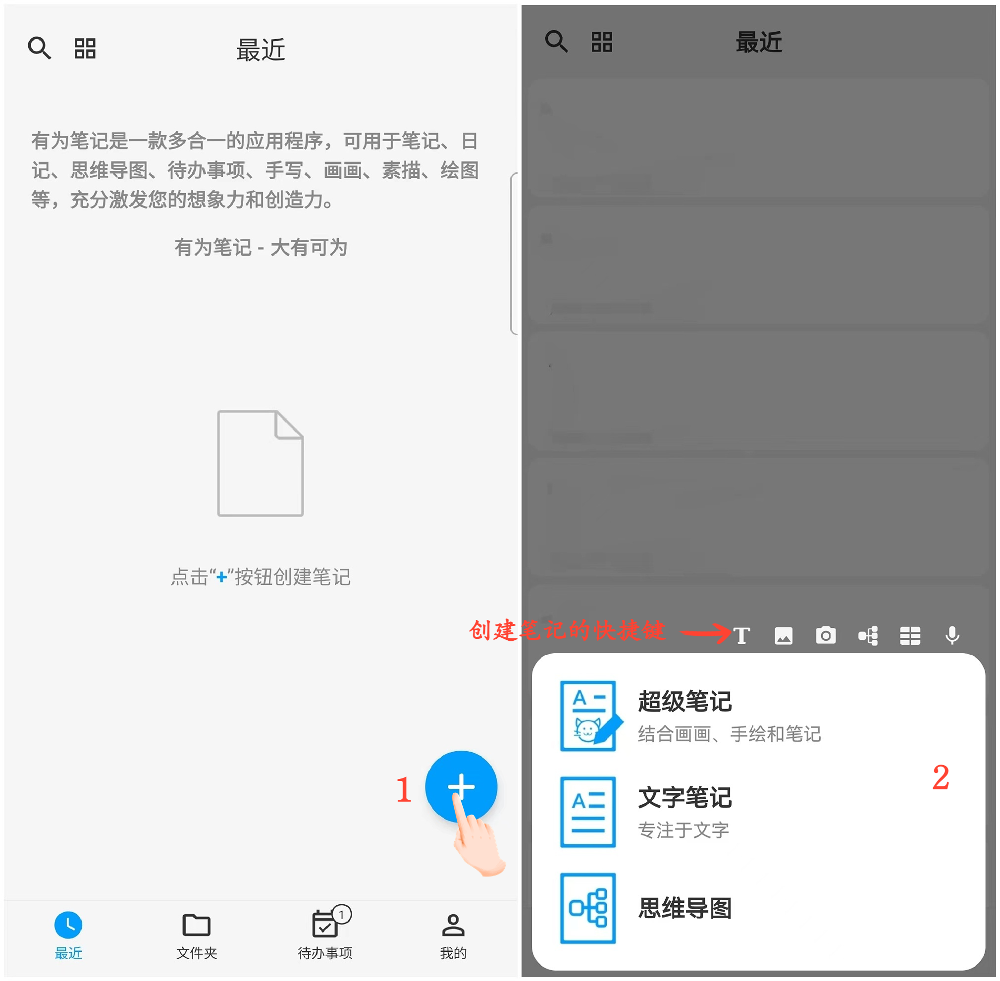

[用户手册](/dragonnest/drawnote/manual) >

新建笔记
---
有为笔记包含超级笔记、文字笔记和思维导图功能。

- 超级笔记：是自由创作区域。具有无限画布，您可以在其中自由涂鸦、放置文字、图片、录音、表格、关联笔记和网页链接等内容。这个功能可以帮助您更加自由直观地记录和展示自己的创意和想法，提高创造力和思维的灵活性。

- 文字笔记：是专注文字区域。您可以在这里进行文字排版、插入图片等操作，方便快捷地记录和整理自己的思路和信息。

- 思维导图：是思维梳理区域。通过思维导图帮助您更好地理清思路、梳理逻辑关系、发掘隐藏的信息和潜力，以更加深入地理解和掌握知识，提高学习效果。

#### 操作步骤

在应用首页，点击右下角的“+”号，选择要创建的笔记类型，开始创作。

#### 进阶操作

- 如果在「文件夹」中点击“+”号创建笔记，笔记会自动归类到当前文件夹。

- 除了直接点击笔记类型，您还可以使用上方的快捷键进入超级笔记相应功能的创作界面，以更快速地进行的笔记操作。
