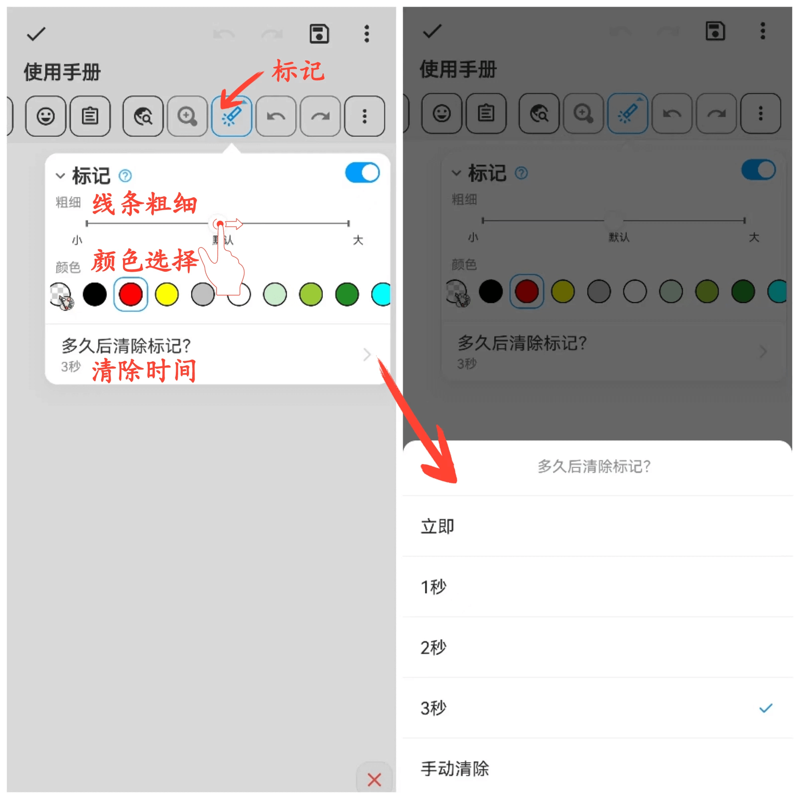

[用户手册](/dragonnest/drawnote/manual) > [更多](/dragonnest/drawnote/manual/other) >

标记功能
---
标记功能可以帮助您发现重点并吸引注意力，适用于教学和演示。

#### 操作步骤
- 点击工具栏中击“标记”按钮，即可在画布中进行标记演示。

- 您可以调整标记线条粗细和选择标记颜色。此外，您还可以设定标记自动清除时间或手动清除标记。

#### 提示
标记功能用于演示，退出画布后标记会被删除。如果需要突出显示内容并永久保存，可以进入编辑模式，使用画笔工具进行标记。