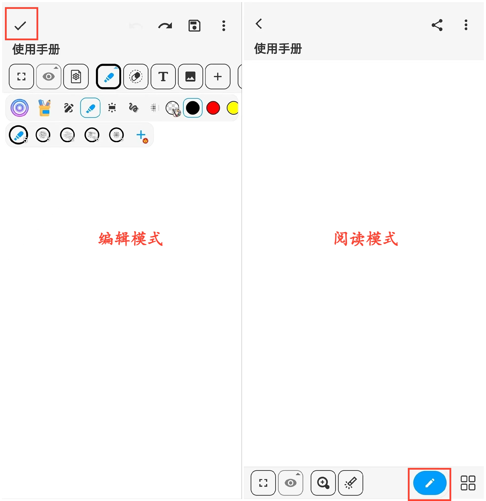

[用户手册](/dragonnest/drawnote/manual) > [更多](/dragonnest/drawnote/manual/other) >

阅读模式和编辑模式
---
阅读模式和编辑模式是笔记的两种状态，用于查看和修改笔记内容。

#### 阅读模式
- 选择要查看的笔记，单击进入阅读模式。

- 如果您正在编辑笔记，请点击左上方的“√”图标，以切换到阅读模式。

#### 编辑模式
如果您正在阅读笔记，请点击右下方“画笔”图标，以切换到编辑模式，进行笔记修改和编辑。

在阅读模式下，您可以：

- 查看笔记内容，放大缩小以获取信息。

- 跳转关联笔记，获取更多相关信息。

- 点击网页链接图标，跳转到相关网页。

- 查看、保存或分享笔记中的图片。

- 点击右上方“⋮”图标，进行重命名、移动、删除、导出等操作。

- 点击下方工具栏，进行默认视图跳转、标记、放大、切换笔记、新建文件夹等操作。等操作。