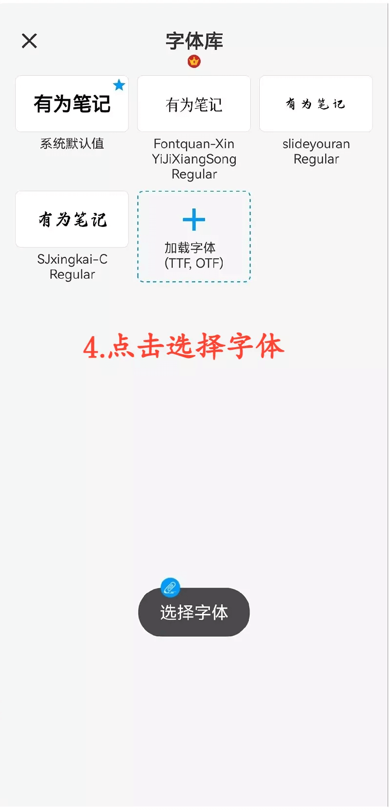

[用户手册](/dragonnest/drawnote/manual) > [更多](/dragonnest/drawnote/manual/other) >

设置默认字体
---
字体库可以保存常用的字体，您可以在文字笔记或者文本编辑框中为文字选择字体。

#### 添加字体
1.点击主页的「我的」。

2.进入设置。

3.点击 "默认字体"。

4.选择您需要的字体。

#### 提示
除了设置默认字体，您可以在设置页面，设置画笔色板颜色位置、设置默认文本大小。