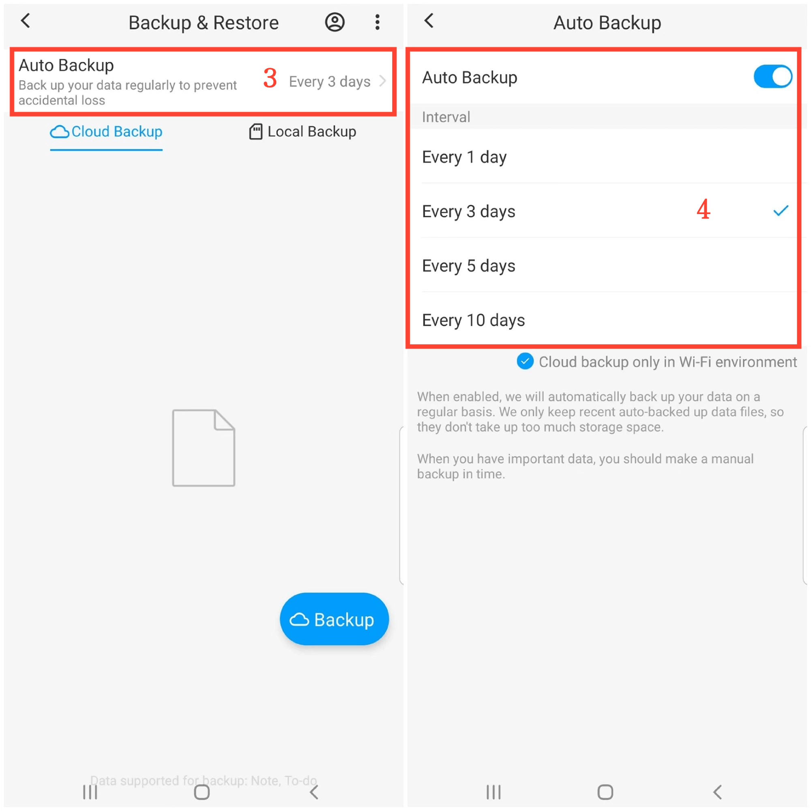

[Manual do Usuário](/dragonnest/drawnote/manual/pt) > [Backup e Recuperação de Dados](/dragonnest/drawnote/manual/pt/data_backup_and_recovery) >

Backup Automático
---
#### Passos

1. Toque em "Eu" na página principal.

2. Vá para a opção "Backup & Restaurar".

3. Selecione a opção "Backup Automático".

4. Ative o interruptor "Backup Automático" e escolha o intervalo de backup. Para proteger seus dados e se preparar para circunstâncias imprevistas.

