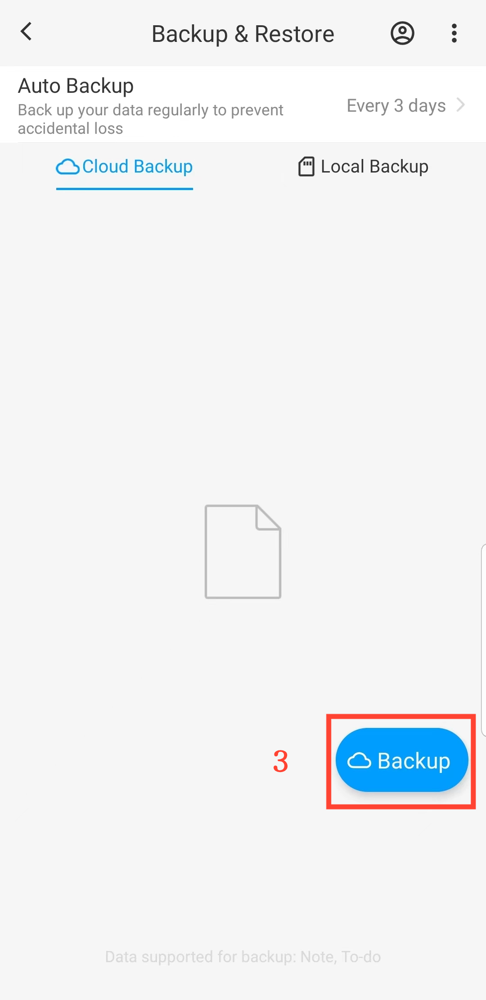

[Manual do Usuário](/dragonnest/drawnote/manual/pt) > [Backup e Recuperação de Dados](/dragonnest/drawnote/manual/pt/data_backup_and_recovery) >

Backup de Dados
---
#### Passos

1. Toque em "Eu" na página principal.

2. Acesse a opção "Backup & Restaurar".

3. Clique em "Backup" para iniciar um backup imediato.

