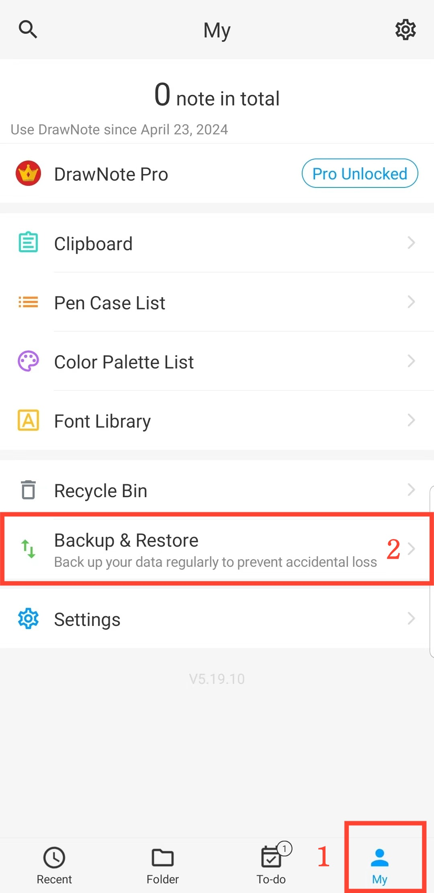

[Manual do Usuário](/dragonnest/drawnote/manual/pt) >

Backup e Recuperação de Dados
---

Com o recurso de backup e recuperação de dados, você pode proteger facilmente informações críticas e evitar perdas inesperadas.
Você pode escolher entre "backup na nuvem" ou "backup local".
- [Backup de Dados](data_backup.md)

- [Backup Automático](automatic_backup.md)

- [Recuperação de Dados](data_recovery.md)

- [Gerenciar Dados de Backup](manage_backup_data.md)

