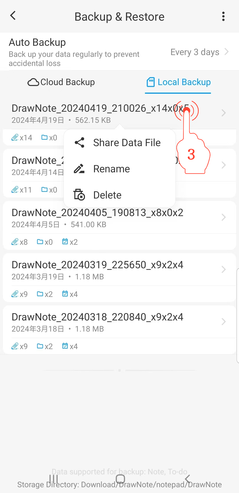

[Manual do Usuário](/dragonnest/drawnote/manual/pt) > [Backup e Recuperação de Dados](/dragonnest/drawnote/manual/pt/backup_e_recuperacao_de_dados) >

Gerenciar Dados de Backup
---
#### Passos

1. Toque em "Eu" na página principal.

2. Acesse a opção "Backup & Restaurar".

3. Pressione e segure uma entrada de arquivo para gerenciar itens de recuperação de dados. Você pode realizar operações de compartilhamento, renomeação e exclusão.

