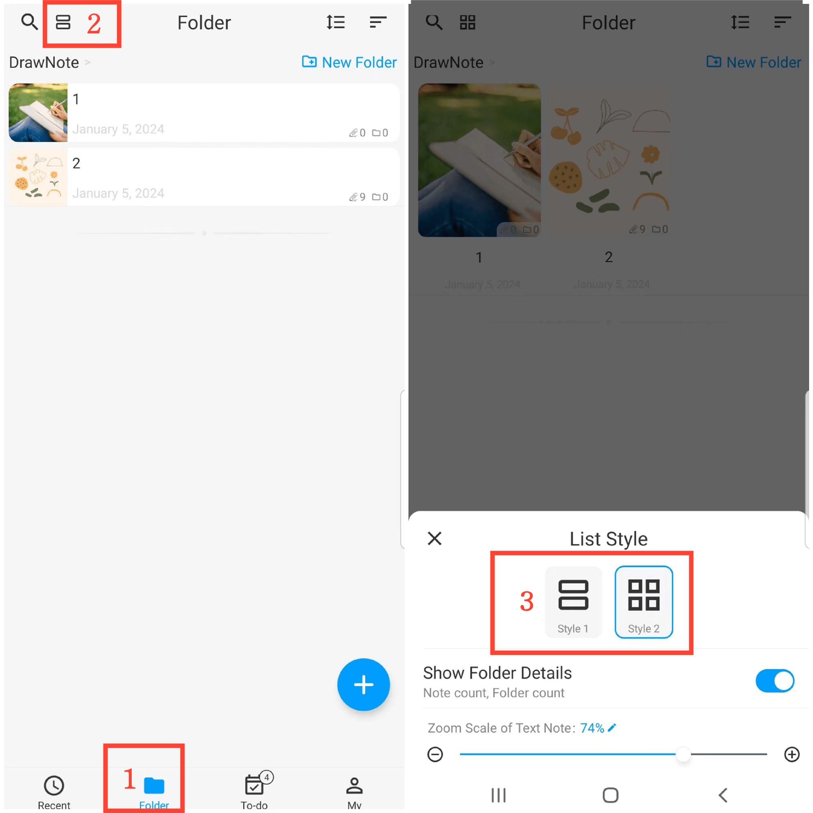

[Manual do Usuário](/dragonnest/drawnote/manual/pt) > [Pasta](/dragonnest/drawnote/manual/pt/folder) >

Estilo de Lista
---
#### Passos

1. Toque em "Pasta" na página principal.
2. Toque no botão "Estilo de Lista" no canto superior esquerdo.
3. Escolha um Estilo.

