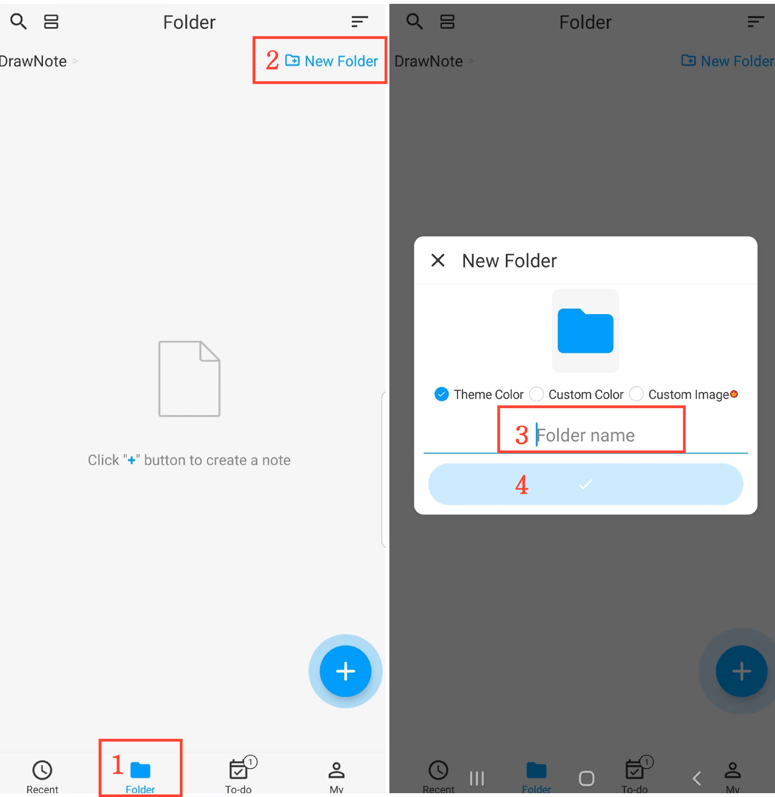

[Manual do Usuário](/dragonnest/drawnote/manual/pt) > [Pasta](/dragonnest/drawnote/manual/pt/pasta) >

Criar Nova Pasta
---
#### Passos

1. Toque em "Pasta" na página principal.

2. Clique no botão "Nova Pasta" no canto superior direito.

3. Insira o nome da pasta.

4. Clique no botão de confirmação.

#### Dicas
- Você pode escolher a cor da pasta ou personalizar a capa ao criar ou editar uma pasta.