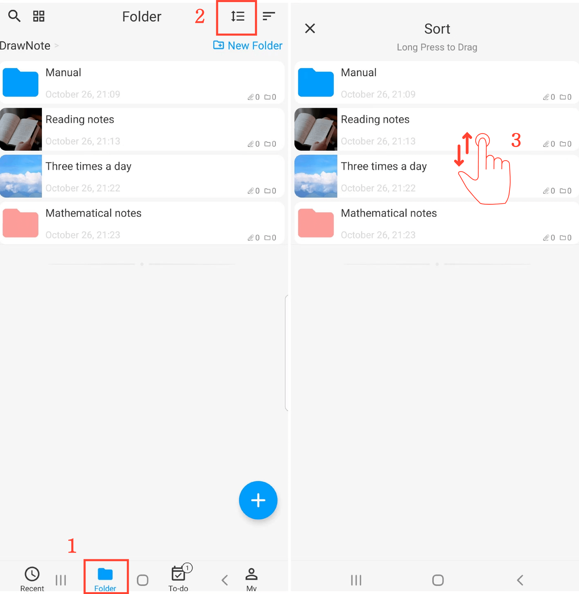

[Manual do Usuário](/dragonnest/drawnote/manual/pt) > [Pasta](/dragonnest/drawnote/manual/pt/pasta) >

Classificar Pastas
---
Existem várias maneiras de classificar pastas. Você pode classificá-las por Nome, Data de Modificação, Data de Criação e mais, ou pode organizá-las manualmente.

#### Selecionar um Método de Classificação
Na página "Pasta", clique no botão "Ordenar Por" e escolha o método de classificação preferido.

#### Classificação Manual
1. Na página "Pasta".

2. Clique no botão "Classificar".

3. Pressione e segure para arrastar as pastas para cima e para baixo para ajustar sua ordem.

