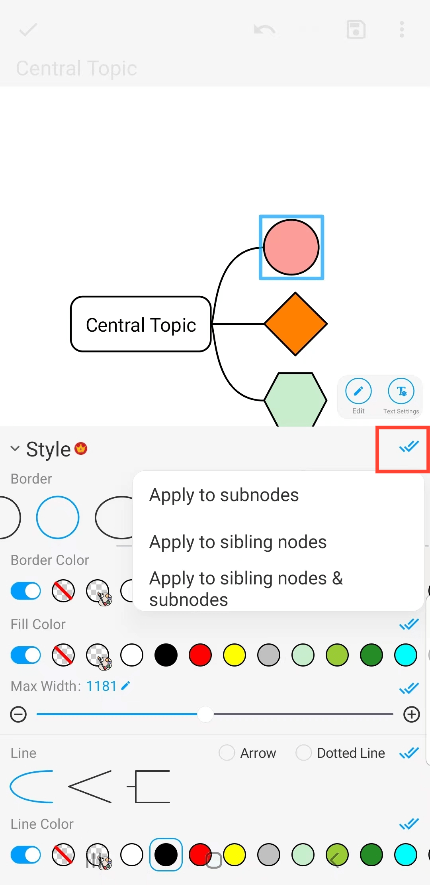

[Manual do Usuário](/dragonnest/drawnote/manual/pt) > [Mapeamento Mental](/dragonnest/drawnote/manual/pt/mind_mapping) >

Bordas e Estilos de Linha
---
#### Passos

1. Clique na moldura do nó que deseja definir.

2. Clique na aba "Estilo".

3. Na janela pop-up, escolha as opções de estilo desejadas, como forma da borda, cor da borda, cor de preenchimento, estilo de linha e cor da linha.

#### Dicas
Clique nas duas marcas de seleção azuis à direita. Para aplicar o estilo aos subnós, nós irmãos ou ambos.

