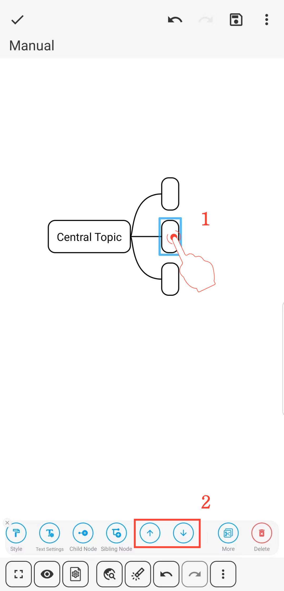

[Manual do Usuário](/dragonnest/drawnote/manual/pt) > [Mapeamento Mental](/dragonnest/drawnote/manual/pt/mind_mapping) >

Movendo Posições de Nós
---

Existem dois métodos para mover posições de nós:

- 1. Pressione e Segure para Mover - Selecione o nó, pressione e segure, arraste-o para a nova localização e solte para completar a movimentação.

- 2. Botão para Mover - Clique no nó, selecione o botão de seta no menu e complete a movimentação da posição do nó.

