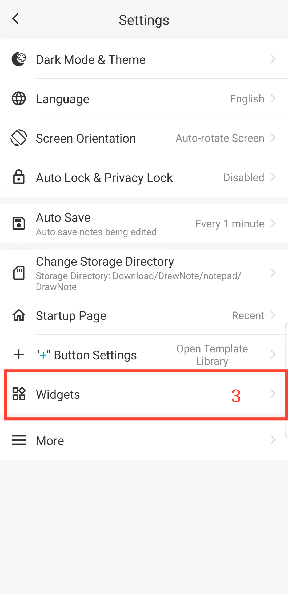

[Manual do Usuário](/dragonnest/drawnote/manual/pt) > [Mais](/dragonnest/drawnote/manual/pt/mais) >

Adicionar Widget de Área de Trabalho
---
Ao adicionar widgets de área de trabalho à tela principal do seu dispositivo, você pode acessar facilmente e rapidamente as funções de edição de notas sem abrir o aplicativo.

### Passos

1. Toque em "Eu" na tela principal.
2. Acesse "configurações".
3. Clique em "Widgets" e selecione o tipo de widget que deseja adicionar.

#### Dicas
Você também pode acessar diretamente as configurações de widget na tela inicial do seu dispositivo, encontrar o aplicativo e, em seguida, adicionar o widget de área de trabalho.