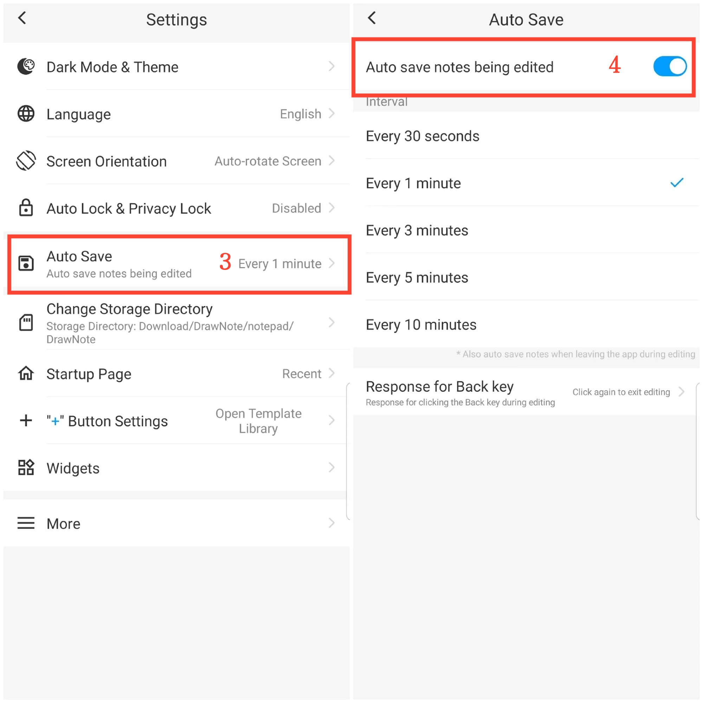
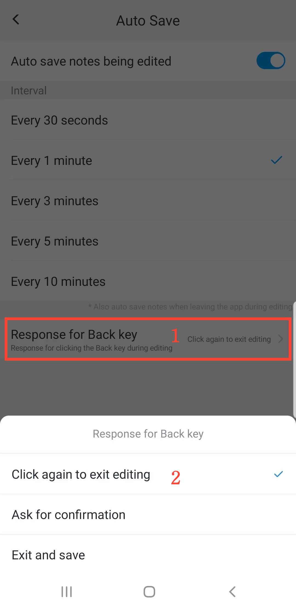

[Manual do Usuário](/dragonnest/drawnote/manual/pt) > [Mais](/dragonnest/drawnote/manual/pt/more) >

Auto Salvamento
---
O auto salvamento evita a perda acidental de dados.

#### Passos

1. Toque em "Eu" na página principal.

2. Acesse as configurações.

3. Clique no botão "Salvar Automaticamente".

4. Ative o interruptor e selecione o tempo de auto salvamento.

#### Dicas
- Resposta personalizável para clicar na tecla Voltar durante a edição. Métodos de resposta incluem: Clique novamente para sair da edição, Perguntar para confirmação, Sair e salvar.

