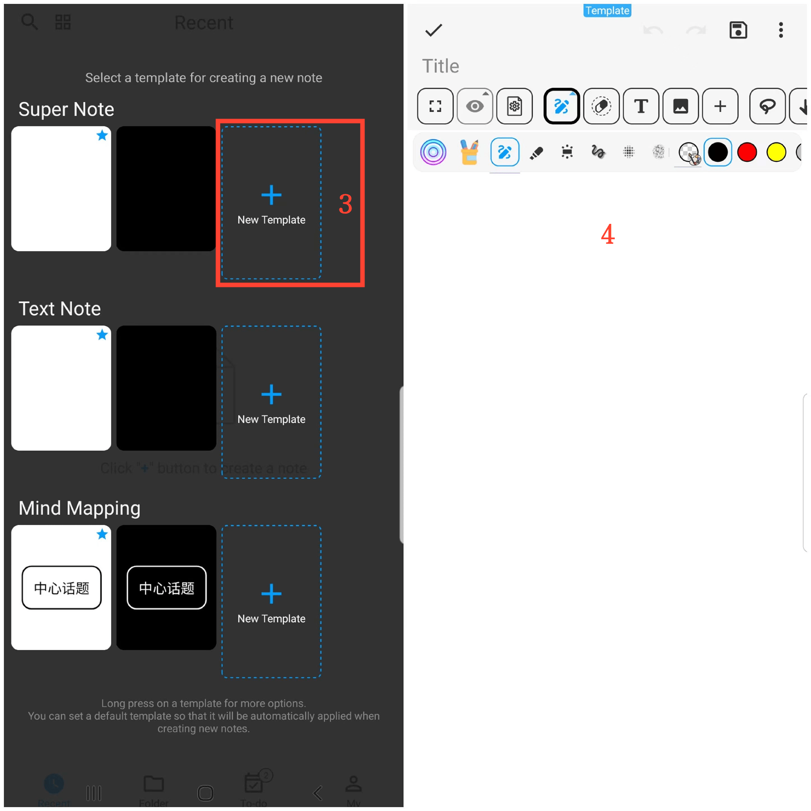

[Manual do Usuário](/dragonnest/drawnote/manual/pt) > [Mais](/dragonnest/drawnote/manual/pt/more) >

Criando Modelos
---
Ao criar modelos, você pode aplicar automaticamente a configuração do modelo ao criar uma nova nota, como cor de fundo, tamanho de fonte, cor da fonte e outras configurações comuns.

### Passos

1. Na página inicial do aplicativo, toque no ícone "+" no canto inferior direito.
2. Toque em "Biblioteca de Modelos".
3. Selecione "Novo Modelo" após o tipo de nota desejado.
4. Entre na página de edição do modelo para configurar as configurações, incluindo cor de fundo, tamanho de fonte, cor da fonte, etc., e salve quando terminar.

#### Dicas
Pressione e segure na biblioteca de modelos para acessar mais opções, como visualizar e Editar Modelo, Definir Como Modelo Padrão, etc.
