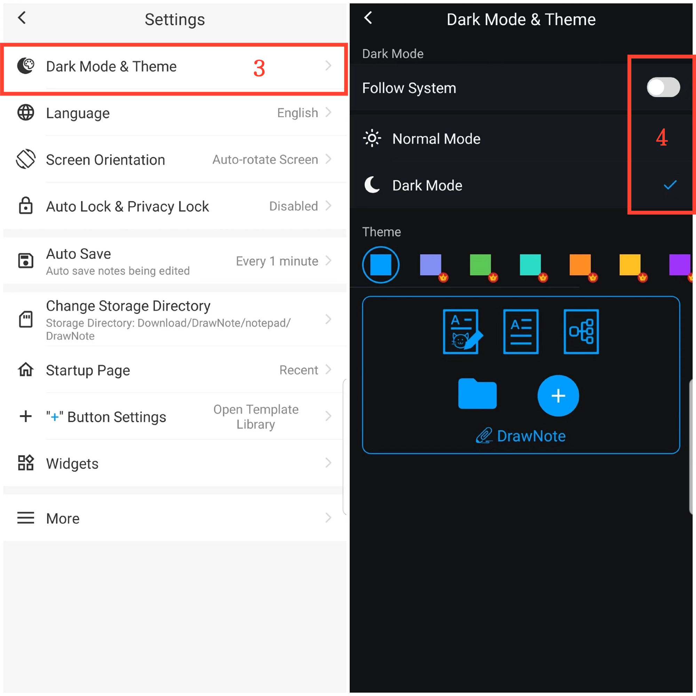

[Manual do Usuário](/dragonnest/drawnote/manual/pt) > [Mais](/dragonnest/drawnote/manual/pt/more) >

Modo Escuro e Alternância de Tema
---
O modo escuro oferece uma experiência de leitura mais confortável, ajudando a reduzir a tensão ocular e proteger a saúde visual. Este recurso permite que você alterne facilmente para um modo escuro mais confortável e escolha cores de tema de acordo com sua preferência pessoal.

### Passos
1. Toque em "Eu" na tela principal.
2. Vá para Configurações.
3. Clique em "Modo Escuro & Tema".
4. Aqui, você pode alternar para o modo escuro e escolher diferentes cores de tema para personalizar a interface de acordo com sua preferência.

