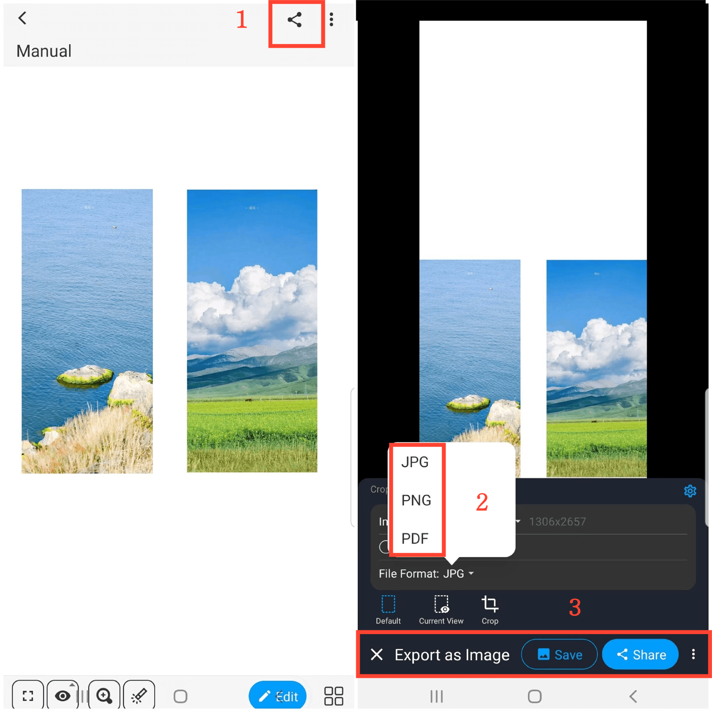

[Manual do Usuário](/dragonnest/drawnote/manual/pt) > [Mais](/dragonnest/drawnote/manual/pt/more) >

Exportar/Compartilhar Notas
---
Existem dois métodos para exportar/compartilhar notas.

#### Método 1
1. No modo de leitura, clique no ícone "Compartilhar" no canto superior direito do canvas.

2. Escolha o formato de arquivo no qual deseja exportar sua nota.

3. Selecione "Salvar" ou "Compartilhar" e escolha o método de compartilhamento para completar a ação.

#### Método 2
1. No modo de leitura, clique no ícone de mais "⋮" no canto superior direito.

2. Selecione "Exportar como Imagem/PDF".

3. Escolha o formato de arquivo no qual deseja exportar sua nota.

4. Clique em "Salvar" ou "Compartilhar" e escolha o método de compartilhamento para completar a ação.

