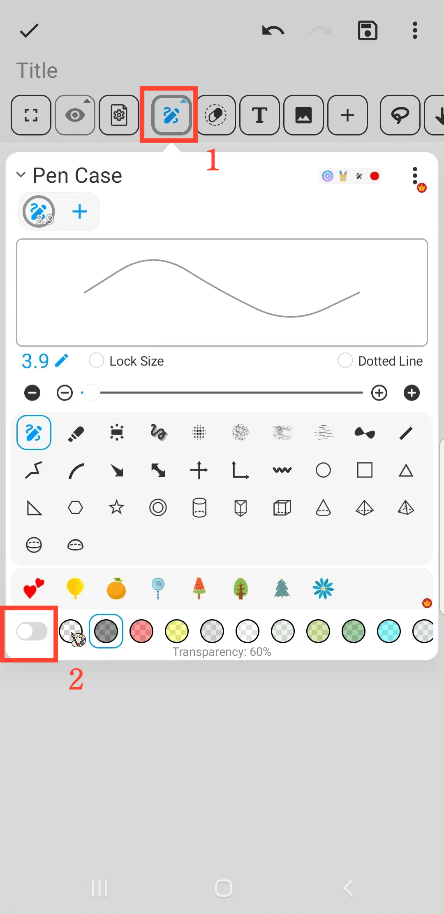

[Manual do Usuário](/dragonnest/drawnote/manual/pt) > [Mais](/dragonnest/drawnote/manual/pt/mais) >

Efeito de Marcação
---
O efeito de marcação pode ajudá-lo a enfatizar informações importantes.

#### Passos
1. Na página de Super Notas, clique no botão "Estojo para Caneta".

2. No menu pop-up, clique no botão inferior para alterar a opacidade da cor da escova e alcançar o efeito de marcação.

