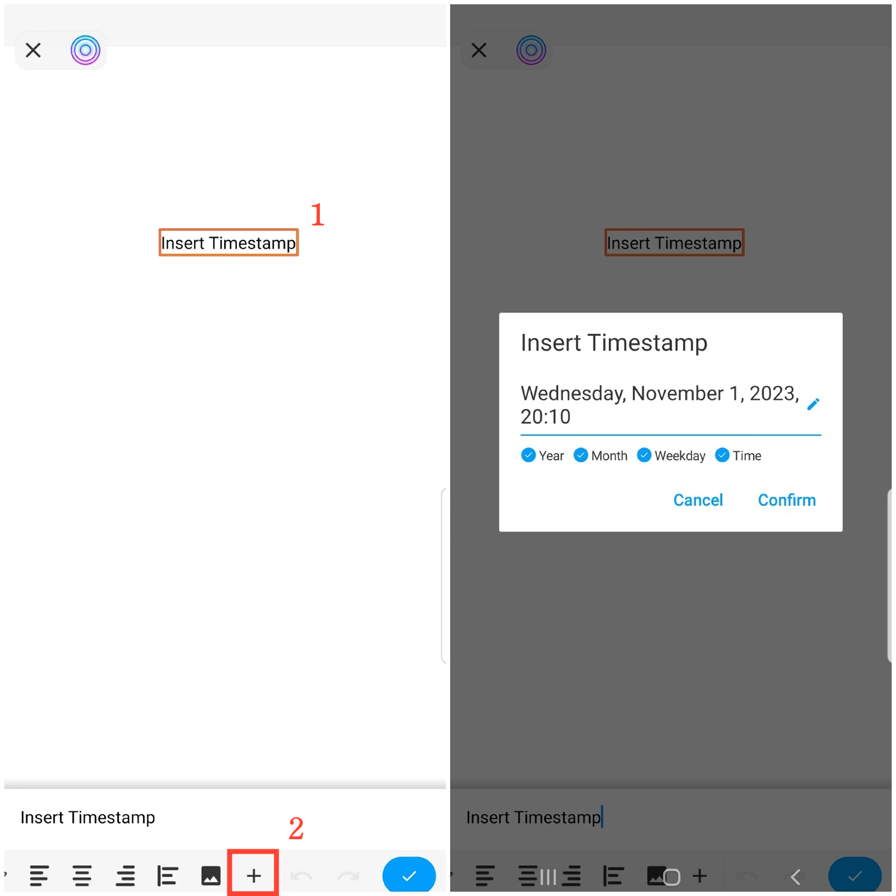

[Manual do Usuário](/dragonnest/drawnote/manual/pt) > Mais

Inserir Carimbo de Data e Hora
---
Inserir um carimbo de data e hora facilita o registro do horário das suas notas.

#### Passos
Em notas de texto, deslize para a esquerda e toque no ícone "+", em seguida, selecione "Inserir Carimbo de Data/Hora" e confirme.

Em Super Notas e Mapeamento Mental, selecione uma caixa de texto, abra o menu de texto, deslize para a esquerda e toque no ícone "+", depois escolha "Inserir Carimbo de Data e Hora" e confirme.

