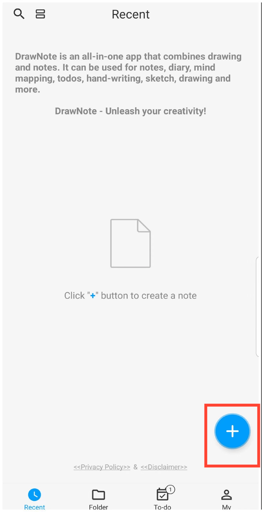

[Manual do Usuário](/dragonnest/drawnote/manual/pt) >

Criar uma Nova Anotação
---
O DrawNote oferece uma variedade de tipos de anotação flexíveis para atender a diferentes cenários de uso, incluindo Super Nota, Anotação de Texto e Mapeamento Mental.

- Super Nota - Uma anotação abrangente que combina escrita à mão, desenho, texto, imagens, gravações de áudio, tabelas e mapas mentais. Permite que você expresse totalmente sua criatividade e talento artístico em um canvas flexível.

- Nota de Texto - Focada na gravação de texto e suporta configurações de texto rico, bem como inserções de imagens, tornando suas anotações mais diversas e visuais.

- Mapeamento Mental - Ajuda você a capturar rapidamente ideias e organizar conhecimento, apresentando conceitos complexos em uma estrutura gráfica clara.

#### Passos

Na página inicial do aplicativo, toque no ícone "+" no canto inferior direito. Em seguida, selecione o tipo de anotação que deseja criar para iniciar sua anotação.

#### Dicas

- Quando você toca no botão "+" na seção 'Pasta' para criar uma nova anotação, a anotação será automaticamente categorizada na pasta atual.

- Você também pode usar os atalhos na parte superior do menu para acessar rapidamente várias interfaces de criação dentro da Super Nota.

