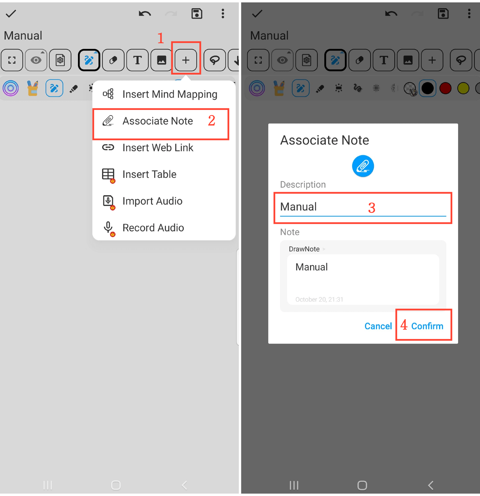

[Manual do Usuário](/dragonnest/drawnote/manual/pt) > [Super Nota](/dragonnest/drawnote/manual/pt/super_note) >

Notas Associadas
---

O recurso de notas associadas permite que você vincule facilmente notas relacionadas, aumentando a organização e a eficiência de busca de suas anotações.

#### Passos

1. Clique no botão "+" na barra de ferramentas.

2. Clique em "Associar Nota" e selecione a nota que deseja vincular.

3. Nomeie a nota associada (opcional).

4. Clique em "Confirmar" para adicionar a nota vinculada à nota atual.

#### Dicas

- Nomear as notas associadas ajuda na busca e gerenciamento mais rápidos.

- Usar os filtros "Ordem Cronológica" ou "Pasta" pode ajudar na seleção mais rápida das notas.