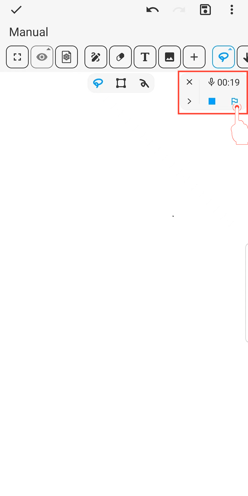

[Manual do Usuário](/dragonnest/drawnote/manual/pt) > [Super Nota](/dragonnest/drawnote/manual/pt/super_note) >

Marcador de Áudio
---
O marcador de áudio é semelhante a um marcador de página, ajudando você a localizar e reproduzir rapidamente seções-chave durante a gravação ou reprodução de áudio.

#### Passos

Durante a gravação ou reprodução, clique no botão "Marcador" para inserir um marcador no tempo atual.

#### Dicas

1. **Ajuste a velocidade do áudio e adicione marcadores** - Facilmente feito na barra de ferramentas.

2. **Edite o nome da gravação e dos marcadores** - Clique no botão "≡" à direita e, em seguida, clique no botão "Lápis".

3. **Baixe o áudio** - Clique no botão "⋮" à esquerda para baixar.

4. **Visualize o histórico de marcadores de áudio** - Veja os marcadores no menu expandido; clique em um marcador para pular rapidamente e reproduzir o áudio.

