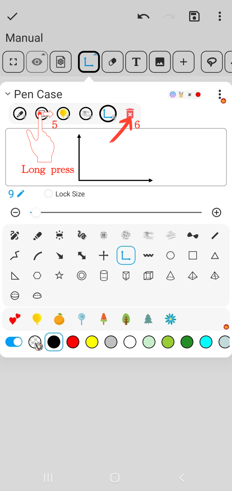
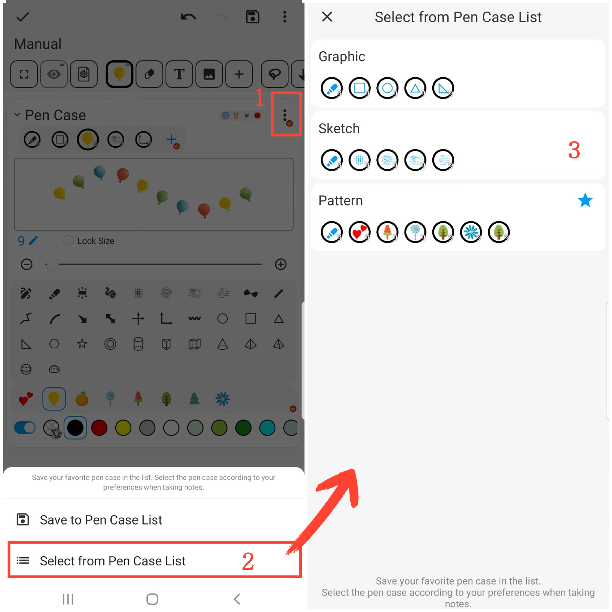

[Manual do Usuário](/dragonnest/drawnote/manual/pt) > [Super Nota](/dragonnest/drawnote/manual/pt/super_note) >

Função de Estojo para Caneta
---

#### Passos

Clique no botão "Estojo para Caneta" na barra de ferramentas para realizar as seguintes ações.

#### 1. Coletar Pincéis

Clique no botão "+" na barra de coleção de pincéis para adicionar diferentes tipos de pincéis.

#### 2. Travar Tamanho do Pincel

Marque o botão "Bloquear Tamanho" para fixar o tamanho do pincel. Mesmo se você ampliar ou reduzir no quadro ou página, o tamanho do pincel permanecerá inalterado.

#### 3. Efeito de Linha Tracejada

Marque o botão "Linha Pontilhada" para aplicar o efeito de pincel de linha tracejada.

#### 4. Ajustar Tamanho do Pincel

Use o controle deslizante central ou os botões "+" e "-" em ambos os lados para ajustar o tamanho do traço do pincel.

#### 5. Ajustar Posição do Pincel
Na barra de pincel, pressione e segure o pincel que deseja ajustar, em seguida, arraste-o para a esquerda ou direita para a posição desejada e solte.

#### 6. Excluir Pincéis Coletados

Na barra de pincel, pressione e segure o pincel que deseja excluir, em seguida, arraste-o para o ícone "Lixeira" e solte para remover esse pincel.

#### Salvar Estojo de Caneta Comum
Na página de pincel, clique no botão "⋮" no canto superior direito e escolha "Salvar na Lista de Pincéis". Em seguida, nomeie seu conjunto de pincéis e confirme para salvar seu conjunto de pincéis comumente usado.

#### Escolher Estojo de Caneta Comum
Na página de pincel, clique no botão "⋮" no canto superior direito, depois selecione o conjunto de pincéis que você precisa na lista de pincéis.

