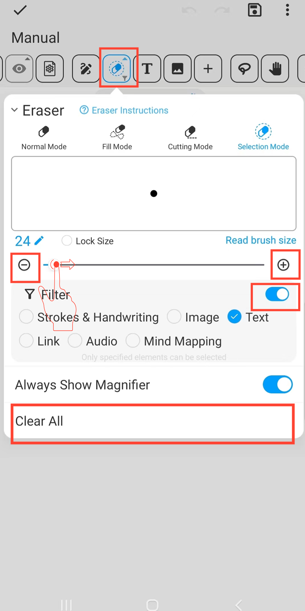

[Manual do Usuário](/dragonnest/drawnote/manual/pt) > [Super Nota](/dragonnest/drawnote/manual/pt/super_note) >

Borracha
---
A função de borracha oferece vários modos para diferentes casos de uso.
#### Passos

Clique no botão "Borracha" na barra de ferramentas.

- Modo normal - Utiliza tecnologia de máscara para simular realisticamente o efeito de borracha. Pode apagar vários elementos como linhas, texto e imagens. Este modo cria marcas de apagamento, permitindo que os usuários selecionem elementos apagados.

- Modo de Preenchimento - Similar ao modo normal, mas pode apagar rapidamente uma área em forma de leque.

- Modo de Corte - Divide os elementos em várias partes independentes, aplicável apenas a linhas e algumas formas geométricas. Este modo não deixa rastros após o apagamento.

- Modo de Seleção - Apaga diretamente o elemento inteiro selecionado e suporta definição de critérios de filtro. Este modo não deixa rastros após o apagamento.

#### Dicas
- Clique em "Limpar Tudo" para esvaziar todo o quadro.