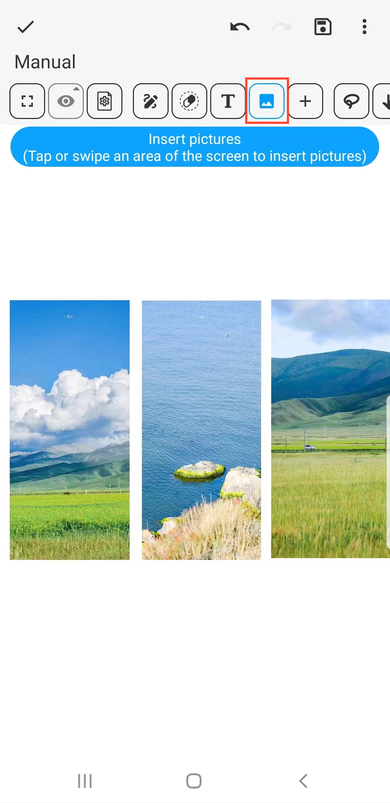

[Manual do Usuário](/dragonnest/drawnote/manual/pt) > [Super Nota](/dragonnest/drawnote/manual/pt/super_note) >

Inserir imagens
---
#### Passos

1. Clique no botão "Imagem" na barra de ferramentas.

2. Toque ou deslize uma área da tela para inserir imagens.

#### Dicas
- Após selecionar uma imagem, a barra de ferramentas inferior fornece opções de edição, como Rotação, Forma e Transparência.

- Você pode combinar o recurso de texto para anotar o conteúdo da imagem para uma expressão mais detalhada e precisa.

- Clique na imagem para redimensioná-la.

