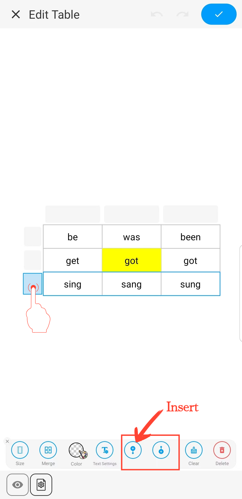

[Manual do Usuário](/dragonnest/drawnote/manual/pt) > [Super Nota](/dragonnest/drawnote/manual/pt/super_note) >

Inserir Tabela
---
#### Passos

1. Clique no botão "+" na barra de ferramentas.

2. Escolha "Inserir Tabela" para adicionar uma tabela às suas notas.

#### Dicas
- Definir o número de células - Deslize ou insira números para escolher o número necessário de células.

- Ajustar largura e altura da tabela - Deslize o controle deslizante de tamanho ou insira números para definir o tamanho padrão da célula.

- Formatar célula - Uma vez selecionada uma célula, você pode definir seu tamanho, cor e limpar seu conteúdo.

- Formatar texto nas células - Uma vez selecionada uma célula, você pode editar seu conteúdo de texto e formato, incluindo cor, tamanho da fonte, negrito, sublinhado e alinhamento.

- Definir formato para uma linha ou coluna inteira - Uma vez selecionada uma linha ou coluna, você pode mesclar células, definir a cor de fundo, limpar o conteúdo e muito mais.

- Inserir uma linha ou coluna inteira - Uma vez selecionada uma linha ou coluna, clique no botão "Inserir" para adicionar uma nova linha ou coluna.

- Definir aparência da tabela - Clique no botão "Configurações" na parte inferior esquerda do quadro e, no menu, defina a cor de fundo e da borda da tabela.

